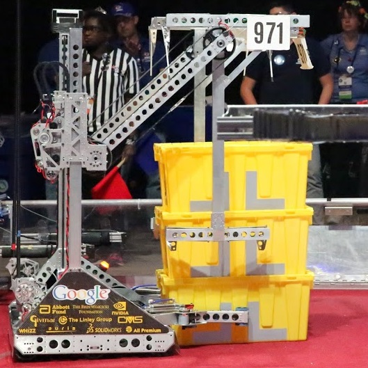
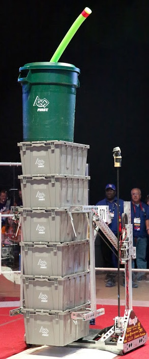
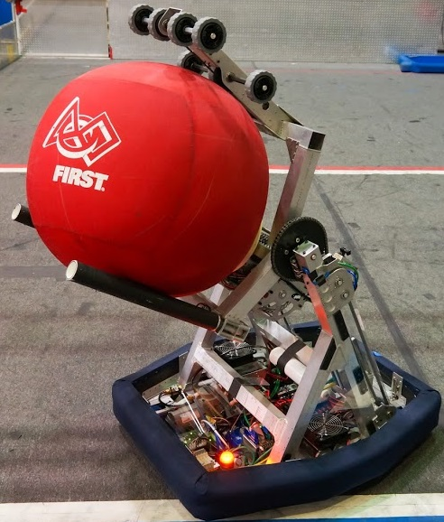
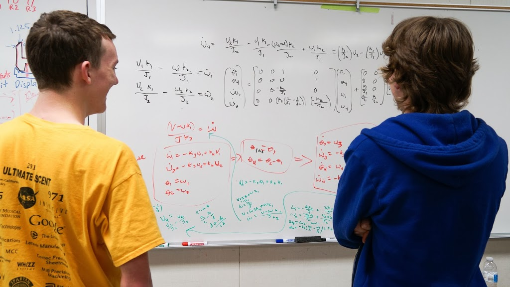

  

    

<h2>Summary</h2>
This page has lots of materials for helping team members learn more about designing, building, and fielding highly competitive robots.
<ul><li><a href="#Training">Team Training</a> - resources to learn more about robot design and describes how new members can be properly trained to use the robotics lab tools.</li><li><a href="#Organization">Team Organization</a> - describes how our team is organized and conducts business.  Our team structure is a key part to our team's success in providing a quality experience for students and building quality robots.</li><li><a href="#RobotDesign">Robot Design</a> - provides a lot of detailed information for our robots including how to download CAD for all of them.  Other teams will likely find this section as interesting as our team members will.</li></ul>
Spartan Robotics team uses a bunch of documents to organize the team and design the robots. Some of these files require membership to the Google FRCTeam971 group to view. Contact Wyn Schuh to be added to this group.

<h2>Team Training</h2>
Participating on a robotics team provides a rich opportunity to develop different technical and business skills across many disciplines.  We encourage team members to develop as many skills as they would like and to specialize in one or more areas.  Due to the lack of unlimited mentor time, we are unable to give one-on-one instruction to students whenever they want it so we are providing the following guidance on how to learn skills in different areas.  The fastest way to develop a broad range of skills for robotics is to read the materials below and do development work outside of team meeting times.  Feel free to contact any of the team students and mentors for guidance and direct help.  Also send any suggestions for improving this page to Michael and/or Wyn.
<ul><ul><li>Robot Design and CAD<ul><li>The Spartan Robotics Team uses <a title="Onshape" href="https://www.onshape.com/en/">Onshape</a> to design our robots. It is powerfull online Computer Aided Design (CAD) tool that generously provided to FRC teams to use by Onshape Inc. For an account to use Onshape, please contact the hardware leads or mentor.</li><li>In the past we used SolidWorks to design our robots. See the team <a href="solidworks-installation-setup-training-and-usage.html">SolidWorks installation, setup, training, and usage page</a> for more information.</li><li>The <a style="font-style: inherit; font-variant: inherit; font-stretch: inherit; line-height: inherit; font-family: inherit; font-size: 14px;" title="971 CAD" href="../wiki/cad.html">CAD file download page</a> has the CAD for our robots starting with the 2007 robot.</li><li>Our friends, 973 the Greybots, created an excellent resource for learning CAD. Here is a link to the <a href="https://www.youtube.com/user/973RAMP/feed">YouTube channel of videos that the 973 Graybots created</a>. It is a fun way to learn solidworks. </li><li>For those of you interested in previous years's robot designs or just more information about FRC design, you can check out sites like <a href="http://www.frc-designs.com/index.html" target="_blank" rel="noopener">FRC designs</a> or FRC team websites such as <a href="http://www.simbotics.org/resources/workshops" target="_blank" rel="noopener">1114</a> or our friends at <a href="http://team254.com/resources/" target="_blank" rel="noopener">254</a>. Some of the best ways to be prepared for designing is to be experienced in what other teams have done in the past and to have good understanding of the building elements that make up a design.  We also have some details about our robots in the </li><li>Here is a <a href="http://www.youtube.com/watch?v=LPeA94gEtp0">video of how we make our sheet metal parts</a> for our robot.  Here is a <a href="http://www.youtube.com/watch?v=QTAX174fkjg">video by Grant from Myth Busters.  He talks about design</a>.  There are a couple of other ones I need to find.  I’ll post later.  Clock is ticking.  Roy, Nov 26, 2012.</li></ul></li><li>Robot Mechanical and Electrical Systems<ul><li>The <a href="https://www.firstinspires.org/resource-library" target="_blank" rel="noopener">FIRST Resources pages</a> include the <a href="https://www.firstinspires.org/resource-library/frc/mechanical-resources" target="_blank" rel="noopener">FRC Mechanical Resources page</a> that has links to documents and pages that describe the robot drive system (using belts, gears, etc.), pneumatics (compressor, pistons, and such), motors, and designing competitive manipulators.</li><li>The <a href="https://wpilib.screenstepslive.com/s/4485/m/24166">2017 Control System Hardware</a> page describes the robot control system and electrical system.</li><li>Notes for working with the <a href="roborio-notes.html">roboRIO</a> - the main computer on the robot.</li></ul></li><li>Awards <ul><li>Notes from Evan Morrison's January 4, 2012<a href="awards-judging-seminar-evan-morrison.html"> Awards Judging Seminar</a></li><li>Chairman's Award: Here’s a websites with some <a href="https://www.firstinspires.org/resource-library/frc/chairmans-award-resources" target="_blank" rel="noopener">tips and examples of past awards submissions</a>. Updated, 08/28/2017.</li><li><a href="https://frc971.org/pdf/AwardsPresentation_20130814_NickCrispie.pdf">Presentation describing the different awards</a> that Nick Crispie made up after heading up the 2013 Spartan Robotics Awards team. Aug 24, 2013 </li></ul></li><li>Manufacturing<ul><li><a href="https://frc971.org/pdf/ManufacturingSponsorship_20130814_NickCrispie.pdf">Presentation describing how to work with team manufacturing sponsors</a> that Nick Crispie made up after being an active member of the 2013 Spartan Robotics Manufacturing team. Aug 24, 2013 </li></ul></li><li>Subversion (SVN)<ul><li>The Spartan Robotics Team uses Subversion (SVN/TortoiseSVN) to manage and share robot CAD, documentation, graphics, and other team files. For access please fill out this <a href="https://forms.gle/iqm4FoNzF3YQBGHK7">form.</a></li><li><a href="svn-usage-0.html">Follow these rules whenever working with SVN</a>.  This is especially important with SolidWorks CAD files.</li><li>One of Austin's UC Berkeley Professors, Prof. Hilfinger, gave the Computer Science Students this 13 page guide to <a href="../files/pdf/subversion_Hilfinger_CS-61B_Fall2008.pdf">Using Subversion</a>.  It is very readable and helpful for learning how to use Subversion.</li></ul></li></ul></ul>

<ul><ul><li>Tool Usage and Tool Training Students, mentors, and guests all need to be trained on any tool they use before they use it. We do this for safety and to keep the tools in good working order.<ul><li><strong style="line-height: 20.0063037872314px;">Hands on Tool Training</strong> is given after people followed the <a href="../join.html">steps to officially join the team.</a><ul><li><strong>Hands on Tool Training </strong>on the basic tools as well as the notcher, Rotex Punch, Press Brake, Sanders, and band saws is given by an authorized trainer after the above items have been completed.  Successfully completing the training is required for students and mentors to use the team tools.  </li></ul><ul><li><a style="line-height: 1.538em;" title="Lathe Training" href="lathe-training.html">Lathe training</a> is more involved and <a style="line-height: 1.538em;" title="Lathe Training" href="lathe-training.html">described here</a>.  Opportunities to be trained on the lathe will be announced when available.</li><li>CNC Router and Mill training will also be announced when available.  Here are slides for the <a href="https://docs.google.com/presentation/d/1rQtrFzIihBjDF6vzpB7_nbCbRkbwZ3JgETKAOR2V-VM">971 CNC Router training</a>.</li></ul></li><li><a style="text-decoration: underline;" href="electrical-safety-training.html">Electrical Safety Training</a> - We will be updating this content soon.</li><li>Waivers from the team training requirements are only given by Michael, Austin, &amp; Travis for people they deem qualified based on their experience.</li><li>The 971 Tool Training Log tracks who is trained on the various tools.  The privilege of using team tools is contingent on being properly trained and will be withdrawn if tools are not being used safely or being used in a way that will be damaging to the tools or anything else.  The team <a title="Team Roles" href="https://docs.google.com/spreadsheet/ccc?key=0AhJ37EAlbQZKdHZpaGphQkVfTTdWbW4zbkxheU5NZlE&amp;usp=drive_web#gid=0">Tool Lead and Safety Lead</a> have final say on who can use tools and how tools can be used.  Only people logged into the <a href="email-lists.html">team Google Group</a> can view the 971 <a href="https://docs.google.com/spreadsheet/ccc?key=0Aqzaard-XnN8dFdEUGdUNDB1cjd6WTNDeDFoajBTTkE&amp;usp=drive_web#gid=0">Tool Training Log</a> and <a href="https://docs.google.com/spreadsheet/ccc?key=0AhJ37EAlbQZKdHZpaGphQkVfTTdWbW4zbkxheU5NZlE&amp;usp=drive_web#gid=0">Team Roles</a> documents.  </li><li>Manuals for several of the 971 Team tools and machines are available in <a title="Tools and Machines" href="https://drive.google.com/?tab=co&amp;authuser=0#folders/0B5gCZnsGaEvFWEp5ZDRlZHlWOU0">Tools and Machines folder</a> in the teams Google Drive.  You have to be on the <a title="971 Team Elist information" href="email-lists.html">971 Team Google Groups Elist</a> and authenticate into your Google account to view these files.</li><li>We require that there be a district fingerprinted adult supervisor who is dedicated to safety in attendance at all meetings.  This is because often other mentors in attendance are focused on working with students and not general safety.  Adult supervisor requirements and guidelines can be found <a href="adult-supervision-responsibilities.html">here</a>.  Information on becoming a district fingerprinted adult can be found <a href="fingerprinting.html">here</a>.</li></ul></li></ul></ul>

<ul><li>Software and Programming<ul><li>The Software team uses Gerrit GIT to manage all code. For access please fill out this <a href="https://forms.gle/iqm4FoNzF3YQBGHK7">form.</a></li><li>The <a href="2017-software.html">2017 software page</a> describes how we set up the programming computers and robot code for the 2017 competition season.</li><li>The <a href="2016-software.html">2016 software page</a> describes how we set up the programming computers and robot code for the 2016 competition season. </li><li>The <a href="2015-software.html">2015 software page</a> describes how we set up the programming computers and robot code for the 2015 competition season. </li><li>The <a href="2014-software.html">2014 software page</a> describes how we set up the programming computers and robot code for the 2014 competition season.  It also has a link to the 2014 robot source code.</li><li>The team programmers use Linux for code development.  Brian Silverman wrote this page that describes how to <a href="getting-started-frc-programming-under-linux.html" target="_self">get started with FRC programming under Linux</a>.  It has some brief comments on GIT in it.</li><li>Travis suggests that students look at these books if they are interested in learning about programming.  The full text of the books is available on line.  The author, Allen Downey, is a professor at Olin College of Engineering where Travis attended college.<ul><li><a href="http://greenteapress.com/thinkcpp/">How to Think Like a Computer Scientist - C++ Version</a> by Allen B. Downey.  We program our robot using C++.</li><li><a title="The full text of the book is available at this link." href="http://www.greenteapress.com/thinkpython/thinkpython.html">Think Python - </a><a title="The full text of the book is available at this link." href="http://www.greenteapress.com/thinkpython/thinkpython.html">How to Think Like a Computer Scientist</a> by Allen B. Downey.  While we don't program the robot in Python, learning Python is an easier language to learn and a very useful and widely used language.  Many Engineers and Scientists use Python on a regular basis and rarely use C++.  Learning C++ is much easier if for people if they understand Python.</li></ul></li></ul></li></ul>
 
<ul><li>First Youth Protection Program (abbreviated YPP)<ul><li>As of May 1st 2014, FIRST Robotics has implemented a new protection policy to raise awareness and prevent unsafe working conditions for frc teams. For more information on the policy, please read <a href="http://www.usfirst.org/sites/default/files/uploadedFiles/About_Us/FIRST-YPP-ProgramGuide.pdf" target="_blank" rel="noopener">this document</a>. FIRST has provided us with an <a href="https://www.youtube.com/watch?v=Llm2mMV8WHs" target="_blank" rel="noopener">introductory video </a>as a quick overview of this program. </li><li>The First Youth Protection Program(YPP) is based on six fundamentals:<ul><li>Supervision of program activities</li><li>Openness</li><li>Clear lines of communication, authority, and decision-making</li><li>Trust, dignity, and respect</li><li>Collaboration and Cooperation</li><li>Regular Review</li></ul></li><li>As a team, Spartan Robotics works hard to maintain a safe working environment for all members. Please let us know if you have any questions or concerns regarding team member safety.</li></ul></li><li>2013 Fall Robot Camp - Starting in 2012, 971 began putting on a robot camp for our team members.  Steve created <a href="https://www.youtube.com/playlist?list=PLk1Mm-3aieXVdmptX99AoIvRqBm3ZFoHk">Roboti Camp Videos</a> for the introduction, example robot, CAD, Outreach, Programming, Leadership, and Student Stories sessions.</li><li>Karthik is a legendary mentor from FRC Team 1114, Simbotics, in Waterloo Canada.  He has given his "Effective FIRST Strategies for Design and Competition" presentation in many venues through the years.  Here are the <a title="2009 slides" href="https://docs.google.com/file/d/0B5gCZnsGaEvFVjFNNlpWZjRqLVU/edit?usp=drive_web">slides</a> and <a title="2012 Video" href="http://www.youtube.com/watch?v=Apk_X-maRf8">video</a> of his 2012 FRC Championship presentation and <a title="2013 " href="http://www.youtube.com/watch?v=smWy7FQ8jLE">video of his November 6, 2013 FRC Ask an Expert presentation</a>.  The first hour of the 2013 video is his presentation and the last hour of it is a question answer session.  The Simbotics <a href="http://www.simbotics.org/node/3901">Team 1114 website resources page</a> has a bunch or resources for building and designing robots and running a FRC team.</li><li>2013 FRC Season Workshops - The purpose of the <a href="http://www.usfirst.org/roboticsprograms/firstplace/frc-kickoff-workshops">2013 FIRST Robotics Competition Season Workshops</a> is to provide teams the opportunity to learn from other teams, mentors, supporters, and suppliers.</li><li><a href="http://frcgamesense.com/dnn/default.aspx" target="_blank" rel="noopener">FRC GameSense</a> is excited to announce (9/18/14) that they are working together on a new series of videos:  <a href="http://www.usfirst.org/roboticsprograms/frc/behind-the-lines">Behind the Lines</a>.  If you were familiar with the Ask an Expert calls, this is the newest version.  The purpose of this series is to educate and help engage participants in the FRC community.  We will feature experts on a variety of topics that are essential for FRC teams to know.  They also have a <a href="https://www.youtube.com/user/FRCGameSense">FRCGameSense YouTube Channel</a>.</li></ul>

<h2>Team Organization</h2><ul><li><a href="team_971_leadership_structure.html">Team Leadership Structure</a> - The team adopted this <a href="team_971_leadership_structure.html">Team Leadership Structure</a> before the 2012/2013 school year and uses it to manage the team.  Team parent and mentor Finbarr Crispie lead the effort to create the 971 team leadership structure.  He worked closely with mentors Wyn, Austin and Michael and student team leaders Kevin, Nick, Brian, and James.  Other students and mentors helped too.  Finbarr and Wyn talked with several teams at the 2012 FIRST Championship Event about how their teams.  Here are their <a href="frc-team-structure-and-leadership-notes.html">notes from these team organization and structure conversations</a>.  They are archived here so that our team and others can learn more about how teams are organized and how it works for them.</li><li><a href="TeamRulesAndExpectations.html">Team Rules and Expectations</a> - This is a document that each member needs to read and agree to.</li><li><a href="https://frc971.org/pdf/Team_971_MemberContract_v3.pdf">Team 971 Member Contract</a> - We require a signed contract for each team member.</li><li><a href="../node/2335.html">Team 971 Photo and Video Policy</a> - We have specific policies regarding the distribution of team media during the season.</li><li>2017-2018 Team roster with phone numbers and email address and <a title="Use this link to add your name to the team roster." href="https://docs.google.com/forms/d/e/1FAIpQLSeF4MDuszx8LTNTnNXyZIvFPmOtkhacXBQ7WgwcMQA0nJqudQ/viewform" target="_blank" rel="noopener">web form to add new members</a>.  Use your <a href="email-lists.html">Google Group EMail list</a> account to access the team rosters.  Wyn copies new entries from the web form to the roster by hand.  Contact her for changes and updates.  Rosters for prior seasons:<a style="font-size: 13.008px; line-height: 20.0063px;" href="https://docs.google.com/spreadsheets/d/1MOXbwyN2pLcfX7qFZDb6pEKW7EpUHeoDFIW_8wKvdQ4/edit#gid=7911459" target="_blank" rel="noopener">2015-2016</a> Stronghold, <a href="https://docs.google.com/spreadsheets/d/12fjCYamAtFwxFxkIfNu3HcxhnVmWk2WHw6y09H56ZX0/edit?usp=drive_web" target="_blank" rel="noopener">2014-2015</a> Recycle Rush, <a style="text-decoration: underline; line-height: 20.0063037872314px;" href="https://docs.google.com/spreadsheet/ccc?key=0As0Mu2wxtJfYdGpLTm1QRzM3V3JPVjhIQTBjUEJ0Z0E&amp;usp=drive_web#gid=0">2013-2014</a> Aerial Assist, <a style="line-height: 1.538em;" href="https://docs.google.com/spreadsheet/ccc?key=0As-H6EOk12djdE10UUpxVXFqaU9VZy1mRDdYdXcwSVE">2012-2013</a> Ultimate Ascent, <a style="line-height: 1.538em;" href="https://docs.google.com/spreadsheet/ccc?key=0As0Mu2wxtJfYdGxnal9SMy0ya1I2OGlTb3ZtYjA2VHc">2012</a> Rebound Rumble; <a style="line-height: 1.538em;" href="https://spreadsheets.google.com/ccc?key=0Aj5k0ETKpPlJdGFjRzVxSGNtcHMzMWlWUEtVQ0UyM3c&amp;hl=en#gid=0">2011</a> Logo Motion</li><li>MVHS <strong>Robotics Lab Phone Number</strong>: As of February 9, 2014, the phone in the robotics lab, MVHS Room P5 can be called by dialing (650) 940-7472.  The phone does not ring very loudly so if no one answers, you can call back and try again or leave a message.  No guarantees that anyone will listen to the messages in a timely fashion though.  </li><li>Description of the <a href="https://docs.google.com/spreadsheet/ccc?key=0AhJ37EAlbQZKdHZpaGphQkVfTTdWbW4zbkxheU5NZlE&amp;usp=drive_web#gid=0">Team Infrastructure Roles</a> and the names of the people responsible for these roles.  </li><li>To help teams understand and implement the FIRST Safety Program, the FIRST created the <a href="https://www.firstinspires.org/resource-library/frc/safety-manual" target="_blank" rel="noopener">FIRST Safety Manual</a>.  It provides information on the FIRST Safety Awareness and Recognition Program.   Please read it to help you safely participate in the FRC program.  Instilling a culture of safety is a value that every individual in the FIRST community must embrace as we pursue FIRST’s mission and vision.  FIRST Robotics Competition (FRC) has adopted safety as a core value and has established the framework for safety leadership in all aspects of the program. </li><li>We have a <a href="permission-slip.html">permission slip</a> that we may start using this season.  When it is used, this form should be printed, filled out, and returned to Wyn Schuh before a student can be an active member on the team.</li><li>FIRST requires that all participants (students and mentors) sign a FIRST Consent and Release form.  We use the FRC electronic Consent and Release form with is good for all FRC competition season events.  Students and their parents access the electronic form in <a href="https://my.usfirst.org/stims/site.lasso">STIMS</a> and mentors access the electronic form in <a href="https://my.usfirst.org/frc/tims/site.lasso">TIMS</a>.  Pages 1, 2, &amp; 4 in the “<a href="http://www.usfirst.org/sites/default/files/uploadedFiles/Robotics_Programs/FRC/Game_and_Season__Info/2012_Assets/Important_Registration_%20Information_STIMS%20_FRC%20_and_FTC_Team_Roster.pdf">Process Overview Document</a>” describe the process for students and their parent approvers.   Returning mentors need to go to the <a href="https://my.usfirst.org/frc/tims/site.lasso">TIMS</a> site and use their username and password from last year to sign the 2013 release form.  New mentors need to click on the "create user account" button on the <a href="https://my.usfirst.org/frc/tims/site.lasso">TIMS</a> page. </li><li><strong><a style="font-weight: normal;" href="sub-team-leader-expectations.html">Sub-Team Leader expectations</a>.</strong></li><li><strong>Purchasing:</strong> use the purchasing form to make a purchase request and/or record purchased items.  The <a href="ordering-procedures.html">Ordering Procedures</a> page describes how to purchase items for the team.  Purchases require pre-approval if you want to be reimbursed using team funds.  Reimbursements for pre-approved purchases can be made by following the <a href="how-get-reimbursed.html">reimbursement directions</a>.  Pre-approval requests are made by email to Wyn or Austin who will approve or deny the request or direct people to the Leadership Council.  Purchases can also be approved by the leadership council.</li><li>We use two <a href="email-lists.html">EMail lists</a> to keep the team informed.</li><li>Team documents can be accessed on the <a href="https://drive.google.com/drive/#folders/0B5gCZnsGaEvFMGU0YzdhNTEtYjcyZC00ODEzLWEwNWEtZTc5NmNlYzVlZWE0/0B5gCZnsGaEvFYmJiYzAyNTgtN2RjNy00MmE2LTllNjYtMzNmMDE0N2E0OGI3">Spartan Robotics FRC 971 Google Drive</a> by those on the <a href="email-lists.html">Google Groups FRC Team  Email List</a>.</li><li><a href="http://team971-2013.blogspot.com/">Team Blog</a></li><li><a href="http://www.signupgenius.com/go/60B0F4DA8AB2E5-build">Friday Dinner signup list</a> -  As a team, we establish a dinner rotation for Friday nights during the build season to support our students and mentors as they work.  Friday is usually a long work day, starting right after school and going into the evening.  Contact Dorit Perry for details.</li><li>Students use the <a href="http://971login.appspot.com">971 login Google application</a> to log their hours for 2012 course credit.</li><li>Here is the process for <a href="fingerprinting.html">adults to become authorized volunteers</a> (also known as fingerprinted) so that they can supervise our team meetings.  As of Fall 2013, we can again use fingerprinted adults to supervise without a school district employee being present.  Dec 4, 2013, Wyn.</li><li>Adults must complete a MVLA School District Volunteer Driver Application and be approved as a volunteer driver to drive students for team related activities. The <a href="volunteer-driver-application-process.html">application process is described here</a>.</li><li>Directions including a map for how to go with the 971 team to the <a href="http://www.boardsailor.com/nasa_map.html">NASA robotics lab</a>.</li><li><a href="frc-971-computers-computing-system-design-document.html">IT computer system computer list, system logs, and design document</a>.</li><li><a href="it-routine-updates.html">IT Routine Updates</a> </li></ul>

<h2>Programming</h2>
Ideally this section will eventually contain pointers to resources that new students can use to understand how our computing hardware and software on the robots is set up and be able to program it.  For now, all it has are a few notes.  See the <a href="#TrainingSoftware">Software and Programming</a> training section for general resources on learning how to program robots.  The <a href="2017-software.html">2017 software page</a> talks about how to download and work with the robot code.

We used at <a href="http://www.fit-pc.com/web/">fit-PC</a> as our on robot secondary computer in 2012 and 2013.  We upgraded to a <a href="http://beagleboard.org/black">BeagleBone Black</a> for the 2014 season.  We discontinued use of a secondary computer with the 2015 release of the roboRIO.
<ul><li>There is a <a href="https://svn.frc971.org/svn/frc971/2012/trunk/src/doc/recovery_disk/README.txt">README</a> in SVN that has instructions on creating a bootable flash drive for debugging the fit-PC.</li><li>There is another <a href="https://svn.frc971.org/svn/frc971/2012/trunk/src/doc/deb-m32/README.txt">README</a> that has instructions on creating debian packages that allow building 32-bit software for the fitpc on a 64-bit development machine.</li></ul>
 

<h2>Robot Design Documents</h2><h3>Ongoing Design Philosophies</h3><ul><li><a href="robot-bumper-creation.html">Bumpers</a></li><li><a href="electrical.html">Electrical</a> - notes on the materials that we use, how we use them, and where to buy them from.</li></ul>

<h3>2019 DESTINATION: DEEP SPACE</h3><ul><li>The <a href="https://firstfrc.blob.core.windows.net/frc2019/Manual/2019FRCGameSeasonManual.pdf">Game Manual</a></li><li>The <a href="2019-software.html">2019 software page</a> has a snapshot of our <a href="2019-software.html">robot source code and additional software resources</a>.</li></ul><h3>2018 FIRST POWER UP</h3><ul><li>The Game<ul><li>Main <a href="https://firstfrc.blob.core.windows.net/frc2018/Manual/2018FRCGameSeasonManual.pdf">FRC Competition Game Manual</a>, one <a href="https://www.firstinspires.org/sites/default/files/uploads/resource_library/frc/game-and-season-info/competition-manual/2018/first-spectatorflyer18-frc-ltr-dec-form.pdf">page game description</a>, and the <a href="https://www.firstinspires.org/resource-library/frc/archived-game-documentation">FRC game links for past competitions</a>.</li><li>Details, Photos, and Videos for our 2018 FIRST POWER UP robot<ul><li>Photos and Videos<ul><li><a href="https://www.chiefdelphi.com/forums/showthread.php?t=163938">Release picture and video</a> on ChiefDelfi.org</li><li><a title="Photos for all seasons" href="../photos.html">Photos</a> for the season including everything from brain storming, pitures of detailed parts, to pitures from the Championship and other competitions.</li><li><a title="Videos for all seasons" href="../videos.html">Videos</a> from the competitions, Chairman's Award submission, and interviews.</li></ul></li><li>Robot design details<ul><li>The <a href="../files/FRC971_2018_TechnicalDocumentation.pdf">technical documentation</a> details our design process and the technical details for our robot.  We gave this document to the judges at the competitions. </li><li>The <a style="font-family: inherit; font-style: inherit; font-variant-ligatures: inherit; font-variant-caps: inherit;" href="../files/FRC971_2018_ControlsDocumentation.pdf">controls documentation</a>  provides additional information on how we used inverse kinematics to control the motions of the robot. We also gave this document to the judges at the competitions.</li><li>The <a style="font-family: inherit; font-style: inherit; font-variant-ligatures: inherit; font-variant-caps: inherit;" title="971 CAD" href="../wiki/cad.html">CAD file download page</a> has the CAD for our robots starting with the 2007 robot and includes CAD for our 2018 robot.  For the 2018 robot, we have posted the CAD in STEP and SolidWorks Native format.  If you open the SolidWorks CAD files in SolidWorks, you will learn a lot about how we design parts and assemblies.</li><li>The <a style="text-decoration-line: underline;" href="2018-software.html">2018 software page</a> has a snapshot of our <a href="2018-software.html">robot source code</a>.</li></ul></li></ul></li></ul></li></ul>

<h3>2017 FIRST STEAMWORKS</h3><ul><li>The Game<ul><li>Main <a href="https://firstfrc.blob.core.windows.net/frc2017/Manual/2017FRCGameSeasonManual.pdf">FRC Competition Game Manual</a>, one <a href="https://www.firstinspires.org/sites/default/files/uploads/resource_library/frc/game-and-season-info/competition-manual/2017/FIRST-FRC-SpectatorFlyer&apos;17-FR021-FORM.pdf">page game description</a>, and the <a href="https://www.firstinspires.org/resource-library/frc/archived-game-documentation">FRC game links for past competitions</a>.<ul><li>Links to an archive of the <a href="http://www.firstinspires.org/resource-library/frc/email-blast-archive">email blasts</a>.</li></ul></li></ul></li><li>Details, Photos, and Videos for our 2017 STEAMWORKS robot<ul><li>Photos and Videos<ul><li><a href="https://www.chiefdelphi.com/forums/showthread.php?p=1659915#post1659915">Release picture and video</a> on ChiefDelfi.org</li><li><a title="Photos for all seasons" href="../photos.html">Photos</a> for the season including everything from brain storming, pitures of detailed parts, to pitures from the Championship and other competitions.</li><li><a href="../videos.html">Videos</a> from the competitions, Chairman's Award submission, and interviews.</li></ul></li><li>Robot design details<ul><li>The <a style="font-family: inherit; font-style: inherit; font-variant-ligatures: inherit; font-variant-caps: inherit;" href="../files/2017-TechnicalDocumentation-971.pdf">technical documentation</a> details our design process and the technical details for our robot.  We gave this document to the judges at the competitions. </li><li>The <a style="font-family: inherit; font-style: inherit; font-variant-ligatures: inherit; font-variant-caps: inherit;" href="../files/2017-ControlsDocumentation-971.pdf">controls documentation</a> provides additional information on how we used inverse kinematics to control the motions of the robot. We also gave this document to the judges at the competitions.</li><li>The <a style="font-family: inherit; font-style: inherit; font-variant-ligatures: inherit; font-variant-caps: inherit;" href="../wiki/cad.html">CAD file download page</a> has the CAD for our robots starting with the 2007 robot and includes CAD for our 2017 robot.  For the 2017 robot, we have posted the CAD in STEP and SolidWorks Native format.  If you open the SolidWorks CAD files in SolidWorks, you will learn a lot about how we design parts and assemblies.</li><li>The <a style="text-decoration-line: underline;" href="2017-software.html">2017 software page</a> has a snapshot of our <a href="2017-software.html">robot source code</a>.</li></ul></li><li>Maintenance and Run Notes<ul><li><a href="https://docs.google.com/document/d/1C1Yb5vy-sViEvNapsEvxehihjiiZtD98utKgz9OL-3U/edit">Robot drive practices and maintenance notes</a> (team members only)</li><li><a href="https://docs.google.com/spreadsheets/d/1bX5933nQIqzB-EWECo4d6WNJpOFCeqI9_05d9xNoUXo/edit#gid=515623390">Battery log</a> (team members only)</li></ul></li></ul></li><li><a href="http://www.firstsv.org/">Silicon Valley Regional Competition website</a> with a nice <a href="http://www.firstsv.org/?page_id=113">map of all of the California teams</a>.</li></ul>

<h3>2016 FIRST Stronghold</h3><ul><ul><li>The Game<ul><li>Main <a href="http://www.firstinspires.org/resource-library/frc/archived-game-documentation">FRC Competition Manual / Q&amp;A System</a>.<ul><li>Section 2.3 TECHNICAL RESOURCES of the <a href="https://firstfrc.blob.core.windows.net/frc2016manuals/AdminManual/FRC-2016-admin-manual.pdf">Administrative Manual</a> describes how FIRST communicates with the teams and has links to archives of the <a href="http://www.firstinspires.org/resource-library/frc/email-blast-archive">email blasts</a>, and more.  </li></ul></li></ul></li><li>2016 Season Product Donation Vouchers (PDV) are given to the team so that they can buy supplies and equipment.  They work like gift certificates.   The <a href="http://www.firstinspires.org/node/5616">FRC PDV page</a> has links and more information.  <a href="http://www.firstinspires.org/robotics/frc/blog/pre-kickoff-virtual-kit-items">FIRST Blog describing these and other virtual kit donation items</a> like SolidWorks and Mathematica.</li><li>Team member only documents<ul><li><a href="https://docs.google.com/document/d/1-8vfWsIHgwVaLx_-Iy5c7bImCuti19c8Zygtrpp3c7c/edit?usp=docslist_api">Drive practice maintenance log</a> (only works for team members signed into their Google account).</li><li><a style="text-decoration: underline;" href="https://docs.google.com/document/d/1VWasCrWDfnCQNNC8S8uV4YtFKHtzAHJoLq7r6Ch38nE/edit?ts=570f2527">Leadership Championship Event Checklist</a> (team members only)</li></ul></li></ul></ul>

<ul><li>Details, Photos, and Videos for our 2016 FIRST Stronghold robot<ul><li>Steve Silverman continues to do a fantastic job taking pictures and videos of the 971 team and robot even after his son graduated from Mountain View High School in 2014.  Unless otherwise noted, the pictures and videos for the 2016 season were taken by Steve.</li><li><a href="http://www.chiefdelphi.com/forums/showthread.php?s=e6d2c98cbd9e0eeb64ae129b37d63325&amp;t=146113">Release picture and video</a> from ChiefDelfi.org - this is a must read.  In addition to the cool release video, the thread contains lots of technical discussions and details about the 2016 robot.  Those that read this entire thread will learn a lot about how we design, build, program, and compete our robots.</li><li>The <a href="../files/2016-TechnicalDocumentation-971.pdf">technical documentation</a> details our design process and the technical details for our robot.  We gave this document to the judges at the competitions.</li><li><a href="https://picasaweb.google.com/117769834305511597729">All 971 photo albums</a> including 2016 season robot pictures by week for weeks 1- 11.</li><li>The <a href="../wiki/cad.html">CAD file download page</a> has the CAD for our robots starting with the 2007 robot and includes CAD for our 2016 robot.</li><li>The <a href="2016-software.html">2016 software page</a> has a snapshot of our <a href="2016-software.html">robot source code</a> taken after the 2016 Championship Event.  At the end of the 2016 year, it will also have a final snapshot of our code taken before the 2017 challenge is released.  It also describes how we set up the programming computers and robot code for the 2016 competition season.</li><li>There is a <a href="http://www.chiefdelphi.com/forums/showthread.php?t=146113">huge amount of <strong>discussion of the technical detail of the 2016 robot</strong></a> in the <a href="http://www.chiefdelphi.com/forums/showthread.php?t=146113">Chief Delphi FRC971 Spartan Robotics 2016 Release Video thread</a>.  A must read for those who want to know more about the robot and how 971 designs, builds, and programs robots.</li><li>FIRST Campionship Event held in St. Louis April 27-30, 2016, 4th seed, playoffs third alliance captain with 1323 MadTown Robotics, finalist defeated by first alliance with 148 Robowranglers and 1678 Citrus Circuits.<ul style="font-size: 13.008px; line-height: 20.0063px;"><li><a style="font-size: 13.008px; line-height: 1.538em;" href="https://picasaweb.google.com/117769834305511597729/6282475809943073569">Photos of the robot at the FRC Championship</a> (the robot and drive team in action)</li><li><a href="https://picasaweb.google.com/117769834305511597729/6282458124682788289">Photos of the team at the FRC Championship</a></li><li><a href="https://www.youtube.com/playlist?list=PLk1Mm-3aieXWZ0wUK2a8pkqKz5j2pusXR">Videos of 4 matches</a> from recent World Championship.  What is covered in the 4 videos:<ul><li>Matches 24 and 90 are mostly closeups of the 971 robot for the entire match - floor level views of the robot unfold-shoot-fold.</li><li>Matches 24 and quarter final include a mixture of full field view and zoom in on 971 robot - shows the full game and the flow of a match as well as some highlights of the 971 robot.</li><li>Matches 24 and 55 - good view of the 971 robot climbing at the end of the match.</li></ul></li><li><a href="https://photos.google.com/share/AF1QipPRTGyBySQ22GZz33kaFI4AjuWYEQJpngAFGNDsLW2GKZ_PrhcGofzh6jd9arwOew?key=dUJqMEt4d0pVVkh6dUpvY1BFUDFsZ2FLcGtiREtR">Pictures and videos by Matt Crowley</a> giving a great view of the Championship event, our robot, and our team.</li><li><a href="http://www.firstchampionship.org">FIRST Championship Event website</a></li><li>FRC <a href="http://www.firstchampionship.org/sites/default/files/first-robotics-competition/2016-frc-cmp-public-schedule.pdf">Team Competition Schedule</a></li><li><a href="http://www.firstchampionship.org/sites/default/files/first-robotics-competition/2016-frc-cmp-a-z.pdf">Championship A-Z Guide</a>: The A-Z Guide contains “THE” Championship information you need to know, organized alphabetically.</li><li><a href="http://www.firstchampionship.org/welcome#block-block-53">Championship Conference Schedule</a>: The FIRST Championship Conferences will be held Wednesday, April 27th- Friday, April 29th. The conferences are free and open to all.</li></ul></li><li>Silicon Valley Regional held at San Jose State April 7-9, 2016<ul><li><a href="https://picasaweb.google.com/117769834305511597729/6276899160559209089?authuser=0&amp;feat=directlink">Photos of the robot at SVR</a> (the robot and drive team in action)</li><li><a href="https://picasaweb.google.com/117769834305511597729/6276931136415696705?authuser=0&amp;feat=directlink">Photos of the team at SVR</a></li><li>Short 3:19 <a href="https://www.youtube.com/watch?v=htWJinmvj-w">video of robot at SVR</a></li></ul></li><li>Sacramento Regional held at UC Davis March 24-26, 2016<ul style="font-size: 13.008px; line-height: 20.0063px;"><li><a href="https://picasaweb.google.com/117769834305511597729/6269431109944479985" target="_blank" rel="noopener">Photos of the team and the event</a></li><li><a href="https://picasaweb.google.com/117769834305511597729/6269456702612764705" target="_blank" rel="noopener">Photos from competition matches</a> (the robot and drive team in action)</li><li><a href="https://youtu.be/Bqd67k2Lmcw" target="_blank" rel="nofollow noopener">Video of Team #971 robot and drive team in action</a> (4 minutes) at the Sacramento Regional [4 minutes]  Includes video of match #22</li><li><a href="https://youtu.be/TSVWgpcHDp4" target="_blank" rel="nofollow noopener">Video of semi-final1 match #1, focusing on team #971</a></li></ul></li><li>Off-Season Events<ul><li>Chezy Champs</li><li>Madtown Throwdown</li></ul></li></ul></li></ul>

<h3>2015 Recycle Rush</h3><ul><ul><li>The Game<ul><li>Main <a href="http://www.usfirst.org/roboticsprograms/frc/2015-game">FRC Recycle Rush competition page</a> with <a href="http://www.usfirst.org/roboticsprograms/frc/2015-game">game video</a> and links to other important game documents such as the <a href="http://www.usfirst.org/roboticsprograms/frc/competition-manual-and-related-documents">competition manual page</a> with <a style="line-height: 1.538em;" href="https://rps01.usfirst.org/frc/manual/2015/FRC2015GameManual.pdf">game description and rules</a> and <a style="line-height: 1.538em;" href="https://www.youtube.com/watch?v=9sryrCE4mAo">Field Tour Video</a>.</li><li>The Competition <a href="https://frc-qa.usfirst.org/Questions.php">Q&amp;A System</a>.</li><li>FRC Mechanical, Control System Hardware, and Software <a href="http://www.usfirst.org/roboticsprograms/frc/technical-resources">Technical Resources</a>.  This is the main FIRST page for learning more about how to build and program the 2015 robot.</li><li>At 7:42 into the <a href="https://www.youtube.com/watch?v=Aj1VBVc-rHo">Kick Off Video</a>, Dean Kamen talks about FRC teams and says that "Robots are nothing but a vehicle.  It is a vehicle that connects kids with serous professional adults."  He talks about teams at 8:30 in the video and says that a really good team is made up diverse members that can pasionatly debate their ideas and embrase the best ideas.  The kick off starts off by talking about mentors.  They repeatedly stess the importance and values of mentors.</li></ul></li><li>Team Documentation<ul><li>Robot Build Season Documentation.  This year we making an effort to better document all stages of the building process.  Documentation is located in the the shared Google Drive under 2014-2015 Season Files &gt; Robot &gt; Documentation. In this folder you can find <a href="https://docs.google.com/document/d/1stWlMzyPhP5zfpR7HlbM8_dcBygOtE84i21ES4Kv2M0">instructions for how to format entries and folders for each week</a>.  It is the responsibility of everyone working on a project on a given day (leader or not) to make sure an update is posted, even if that is just a one sentence recap of the work done. Everyone, leader or not, can and should contribute to the documentation.   Feel free to ask Morgan if you have any questions.   Jan 6, 2015</li></ul></li><li>CAD<ul><li>Everybody working on CAD, it is very important to pay attention to the properties of SolidWorks files that you create. These properties determine what shows up on the drawings we send to manufacturers, so if these aren't done right, we WILL get parts made wrong and/or not all of our parts made. Whenever you create a file, rename a file, copy a file, or delete a file, make sure to update its status both in the <a href="https://docs.google.com/spreadsheets/d/1_gjIFkbyO2ZV8DRWbuKhCr_DstwYD-vyuMhzjLKHvIU/edit#gid=0">robot parts spreadsheet</a> and in the properties for the file.</li></ul></li></ul></ul>

<ul><li>Details, Photos, and Videos for our 2015 Recycle Rush robot<ul><li style="font-family: inherit; font-style: inherit; font-variant: inherit; line-height: inherit; list-style: disc; margin-left: 2em !important;">Photos <ul style="margin-top: 0px; margin-bottom: 1em; margin-left: 0px; font-family: inherit; font-style: inherit; font-variant: inherit; line-height: inherit; list-style-type: none;"><li style="font-family: inherit; font-style: inherit; font-variant: inherit; line-height: inherit; list-style: disc; margin-left: 2em !important;"><a style="color: #1155cc; font-family: inherit; font-style: inherit; font-variant: inherit; line-height: inherit;" href="https://picasaweb.google.com/117769834305511597729/2015SeasonSummaryHighlightPhotos">Summary Photo Album of the 2015 Season</a></li><li style="font-family: inherit; font-style: inherit; font-variant: inherit; line-height: inherit; list-style: disc; margin-left: 2em !important;"><a style="color: #1155cc; font-family: inherit; font-style: inherit; font-variant: inherit; line-height: inherit;" href="https://picasaweb.google.com/117769834305511597729">All of the Spartan Robotics 971 photo albums</a>.</li></ul></li><li style="font-family: inherit; font-style: inherit; font-variant: inherit; line-height: inherit; list-style: disc; margin-left: 2em !important;">Robot design details<ul style="margin-top: 0px; margin-bottom: 1em; margin-left: 0px; font-family: inherit; font-style: inherit; font-variant: inherit; line-height: inherit; list-style-type: none;"><li style="font-family: inherit; font-style: inherit; font-variant: inherit; line-height: inherit; list-style: disc; margin-left: 2em !important;">The <a href="../files/2015-TechnicalDocumentation-971.pdf">technical documentation</a> details our design process and the technical details for our robot.  We gave this document to the judges at the competitions. </li><li style="font-family: inherit; font-style: inherit; font-variant: inherit; line-height: inherit; list-style: disc; margin-left: 2em !important;">The <a href="../files/2015-ControlsDocumentation-971.pdf">controls documentation</a> provides additional information on how we used inverse kinematics to control the motions of the .  We also gave this document to the judges at the competitions.</li><li style="font-family: inherit; font-style: inherit; font-variant: inherit; line-height: inherit; list-style: disc; margin-left: 2em !important;"><a style="color: #1155cc; font-family: inherit; font-style: inherit; font-variant: inherit; line-height: inherit;" href="../wiki/cad.html">CAD file download page</a>.</li><li style="font-family: inherit; font-style: inherit; font-variant: inherit; line-height: inherit; list-style: disc; margin-left: 2em !important;">The <a style="color: #1155cc; font-family: inherit; font-style: inherit; font-variant: inherit; line-height: inherit;" href="2015-software.html">2015 software page</a> will have a snapshot of our <a style="color: #1155cc; font-family: inherit; font-style: inherit; font-variant: inherit; line-height: inherit;" href="2015-software.html">robot source code</a> as of the end of 2015 season.  It also describes how we set up the programming computers and robot code for the 2015 competition season.</li><li style="font-family: inherit; font-style: inherit; font-variant: inherit; line-height: inherit; list-style: disc; margin-left: 2em !important;">Photo albums showing <a style="color: #1155cc; font-family: inherit; font-style: inherit; font-variant: inherit; line-height: inherit;" href="https://picasaweb.google.com/117769834305511597729/2015StrategyPlanningFRCTeam971SpartanRobotics" target="_self">strategy</a>, <a style="color: #1155cc;" href="https://picasaweb.google.com/117769834305511597729/2015ProtoypingFRCTeam971SpartanRobotics" target="_self">prototyping</a>, <a style="color: #1155cc;" href="https://picasaweb.google.com/117769834305511597729/2015CADFRCTeam971SpartanRobotics" target="_self">CAD</a>, <a style="color: #1155cc;" href="https://picasaweb.google.com/117769834305511597729/2015FabAssemblyPart_1FRCTeam971SpartanRobotics" target="_self">fabrication and assembly part 1</a>, <a style="color: #1155cc;" href="https://picasaweb.google.com/117769834305511597729/2015FabAndAssemblyPart_2FRCTeam971SpartanRobotics" target="_self">fabrication and assembly part 2</a>, and <a style="color: #1155cc;" href="https://picasaweb.google.com/117769834305511597729/2015PracticeAndDesignImprovementsFRCTeam971SpartanRobotics">practice and design improvements</a>.</li><li style="font-family: inherit; font-style: inherit; font-variant: inherit; line-height: inherit; list-style: disc; margin-left: 2em !important;">Video showing <a style="color: #1155cc;" href="https://www.youtube.com/watch?v=U0WK7mKOhoc">carbon fiber fabrication</a> by Steve Silverman</li></ul></li><li style="font-family: inherit; font-style: inherit; font-variant: inherit; line-height: inherit; list-style: disc; margin-left: 2em !important;">Sacramento Regional held at UC Davis<ul style="margin-top: 0px; margin-bottom: 1em; margin-left: 0px; font-family: inherit; font-style: inherit; font-variant: inherit; line-height: 1.538em; list-style-type: none;"><li style="font-family: inherit; font-style: inherit; font-variant: inherit; line-height: inherit; list-style: disc; margin-left: 2em !important;">The team was picked by 1671, Buchanan Bird Brains, and also paired with 2035, Rockin Bots, but unfortunately the alliance was knocked out in the Semi finals</li><li style="font-family: inherit; font-style: inherit; font-variant: inherit; line-height: inherit; list-style: disc; margin-left: 2em !important;">Video playlist with <a style="color: #1155cc; font-family: inherit; font-style: inherit; font-variant: inherit; line-height: inherit;" href="https://www.youtube.com/playlist?list=PLk1Mm-3aieXVzGaz9RAQq_DmqELmsCnxA">three matches</a> from Steve Silverman</li><li style="font-family: inherit; font-style: inherit; font-variant: inherit; line-height: inherit; list-style: disc; margin-left: 2em !important;"><a style="color: #1155cc;" href="https://picasaweb.google.com/117769834305511597729/2015SacramentoRegionalFRCTeam971SpartanRobotics">Photos from Steve Silverman</a></li></ul></li><li style="font-family: inherit; font-style: inherit; font-variant: inherit; line-height: inherit; list-style: disc; margin-left: 2em !important;">Silicon Valley Regional held at San Jose State University <ul style="margin-top: 0px; margin-bottom: 1em; margin-left: 0px; font-family: inherit; font-style: inherit; font-variant: inherit; line-height: inherit; list-style-type: none;"><li style="font-family: inherit; font-style: inherit; font-variant: inherit; line-height: inherit; list-style: disc; margin-left: 2em !important;">The team was picked by 2085, the RoboDogs, and also paired up with 649, M-set. The alliance made it to the Finals where they lost to a very powerful alliance. By making it to the finals, 971 earned a wildcard spot, aka a championship bid.</li><li style="font-family: inherit; font-style: inherit; font-variant: inherit; line-height: inherit; list-style: disc; margin-left: 2em !important;">971 also won the Engineering Excellence Award sponsored by Delphi.</li><li style="font-family: inherit; font-style: inherit; font-variant: inherit; line-height: inherit; list-style: disc; margin-left: 2em !important;">Video playlist with <a style="color: #1155cc; font-family: inherit; font-style: inherit; font-variant: inherit; line-height: inherit;" href="https://www.youtube.com/playlist?list=PLk1Mm-3aieXVYVQZTZCpi6JFgWH-6-tfB">four matches</a> from Steve Silverman. In Finals Match 1, our robot participates in a very exciting can race!</li><li style="font-family: inherit; font-style: inherit; font-variant: inherit; line-height: inherit; list-style: disc; margin-left: 2em !important;"><a style="color: #1155cc; font-family: inherit; font-style: inherit; font-variant: inherit; line-height: inherit;" href="https://picasaweb.google.com/117769834305511597729/2015SiliconValleyRegionalSVRFRCTeam971SpartanRobotics" target="_blank" rel="noopener">Photos from Steve Silverman</a>.</li></ul></li><li style="font-family: inherit; font-style: inherit; font-variant: inherit; line-height: inherit; list-style: disc; margin-left: 2em !important;">FIRST Championship Event held in Saint Louis, Missouri<ul style="margin-top: 0px; margin-bottom: 1em; margin-left: 0px; font-family: inherit; font-style: inherit; font-variant: inherit; line-height: inherit; list-style-type: none;"><li style="font-family: inherit; font-style: inherit; font-variant: inherit; line-height: inherit; list-style: disc; margin-left: 2em !important;">After Qualification Matches, Spartan Robotics seeded 1st in the Carver division. We picked team 1717, D'penguineers, team 2834, Bionic Black Hawks, and team 5431, Titan Robotics. The alliance lost in the Semi Final round after the 971 robot malfunctioned in Semi Final 1.</li><li style="font-family: inherit; font-style: inherit; font-variant: inherit; line-height: inherit; list-style: disc; margin-left: 2em !important;"><a style="color: #1155cc; font-family: inherit; font-style: inherit; font-variant: inherit; line-height: inherit;" href="https://picasaweb.google.com/117769834305511597729/2015WorldChampionshipFRCTeam971SpartanRobotics">Photos from Steve Silverman</a></li><li style="font-family: inherit; font-style: inherit; font-variant: inherit; line-height: inherit; list-style: disc; margin-left: 2em !important;">Video playlist with <a href="https://www.youtube.com/playlist?list=PLk1Mm-3aieXXPxNPv4lDq1KeLC3KA0K-b">four matches</a> from Steve Silverman. Match 70 was the Carver Field high score.</li></ul></li></ul></li></ul>

<h3>2014 AERIAL ASSIST</h3><ul><ul><li><a style="text-decoration: underline;" href="http://www.usfirst.org/roboticsprograms/frc/game-and-season-info">Game and Season Information</a> from FIRST</li><li><a style="line-height: 1.538em;" href="http://www.usfirst.org/roboticsprograms/frc/game-and-season-info">Game and Season Info</a> - This page also lists important documents and updates for the FIRST Robotics Competition Season.  It has links to the Competition Manual, Team Updates, Kit of Parts, game Q &amp; A, Awards, News and Email Blasts, and more</li><li><a href="http://www.youtube.com/playlist?list=http://www.youtube.com/user/FRCTeamsGlobal">Kick-Off videos</a>, <a href="http://www.youtube.com/watch?v=f5zWzICG5to">game video</a>, and <a href="http://www.youtube.com/user/FRCTeamsGlobal/videos?shelf_id=4&amp;sort=dd&amp;view=0">field tour videos</a>. The following videos cover field info and rules.<a style="font-family: arial, sans-serif; line-height: normal; color: #1155cc;" href="http://www.youtube.com/watch?v=vdhUFSwaroc" target="_blank" rel="noopener">Field video #1</a>, <a style="font-family: arial, sans-serif; line-height: normal; color: #1155cc;" href="http://www.youtube.com/watch?v=7U75iQZBYPU" target="_blank" rel="noopener">Field video #2</a>, <a style="font-family: arial, sans-serif; line-height: normal; color: #1155cc;" href="http://www.youtube.com/watch?v=8-vZmd3Vu9g" target="_blank" rel="noopener">Field video #3</a>, <a style="font-family: arial, sans-serif; line-height: normal; color: #1155cc;" href="http://www.youtube.com/watch?v=2wiqmM-oi6c" target="_blank" rel="noopener">Field video #4</a>, <a style="font-family: arial, sans-serif; line-height: normal; color: #1155cc;" href="http://www.youtube.com/watch?v=qc-a7-sxs4Q" target="_blank" rel="noopener">Field video #5</a>, <a style="font-family: arial, sans-serif; line-height: normal; color: #1155cc;" href="http://www.youtube.com/watch?v=Azc8AKzgEwE" target="_blank" rel="noopener">Field video #6</a>, <a style="font-family: arial, sans-serif; line-height: normal; color: #1155cc;" href="http://www.youtube.com/watch?v=H6L-ZyDg-as" target="_blank" rel="noopener">Field video #7</a>, <a style="font-family: arial, sans-serif; line-height: normal; color: #1155cc;" href="http://www.youtube.com/watch?v=ERuueIzr9IM" target="_blank" rel="noopener">Field video #8</a>, <a style="font-family: arial, sans-serif; line-height: normal; color: #1155cc;" href="http://www.youtube.com/watch?v=etLj6iytcsw" target="_blank" rel="noopener">Field video #9</a>, &amp; <a style="font-family: arial, sans-serif; line-height: normal; color: #1155cc;" href="http://www.youtube.com/watch?v=fI_pscTtMVI" target="_blank" rel="noopener">Field video #10</a>.</li><li>News Paper Articles<ul><li>"<a href="http://www.losaltosonline.com/news/sections/schools/210-school-features/47154-">MVHS robotics team requires more than just technical skills</a>," Los Altos Town Crier, April 2, 2014.  Staff Writer Traci Newell does a wonderful job capturing the spirit of our team in this article.</li></ul></li></ul></ul>

<ul><li>Details, Photos, and Videos for our 2014 Aerial Assist robot named <strong>Mammoth</strong>.<ul><li>Robot release <a href="http://www.chiefdelphi.com/forums/showthread.php?t=127804">photo</a> and <a href="http://www.youtube.com/watch?v=Sy27Om57GbM&amp;list=UU5ihzGjLpKAGaLFCB2kGxTQ">video of our robot in action</a>.</li><li>Photos<ul><li><a href="https://picasaweb.google.com/117769834305511597729/2014Top50PhotosFromFRCTeam971SpartanRobotics">Top 50 photos</a> from 2014 season.</li><li><a href="https://picasaweb.google.com/117769834305511597729">All of the Spartan Robotics 971 photo albums</a>.</li></ul></li><li>Videos<ul><li><a href="https://www.youtube.com/playlist?list=PLk1Mm-3aieXVvbXyqzUNm7IVseZsNwGhm">Seven match videos</a>.  The team was undefeated in the Sacramento and Silicon Valley Regional competitions, and captain of the 2nd place alliance in the Newton division of the world championship in St Louis.</li><li><a href="https://www.youtube.com/watch?v=MDSNazdHCI4">90 second video from RoboNanza</a> event hosted by Intuitive Surgical, one of our sponsors.  The video shows our robot in action with our several year driver Douglas at the wheel and a first day rookie team member, Chris, on the manipulator controls.</li></ul></li><li>Robot design details<ul><li>The <a href="../files/2014-TechnicalDocumentation.pdf">Technical documentation</a> details our design process and the technical details for our robot.  We gave this document to the judges at the competitions. </li><li>The <a href="../files/2014-ControlsDocumentation.pdf">Controls Documentation</a> provides additional information on how we used a secondary computer and advanced control algorithms on Mammoth.  We also gave this document to the judges at the competitions.</li><li><a href="../wiki/cad.html">CAD file download page</a>.</li><li>The <a href="2014-software.html">software page</a> has a snapshot of our <a href="2014-software.html">robot source code</a> as of the end of 2014 season.  It also describes how we set up the programming computers and robot code for the 2014 competition season.</li><li>Chief Delphi thread <a href="http://www.chiefdelphi.com/forums/showthread.php?t=129554">discussing the drive train and octagonal drive base</a>.  CAD <a href="https://picasaweb.google.com/117769834305511597729/2014CADScreenshots">screenshots showing the drive base</a>.  Cycling through the first five of these images shows how the drivebase parts are assembled and work together.</li><li>Chief Delphi thread discussing <a href="http://www.chiefdelphi.com/forums/showthread.php?t=129574">control system</a>.</li><li>Photo albums showing <a href="https://picasaweb.google.com/117769834305511597729/2014FRCTeam971SpartansBrainstormAndPrototype">brainstorming and prototyping</a>, <a href="https://picasaweb.google.com/117769834305511597729/2014FRCTeam971SpartansFabAndAssembly">fabrication and assembly</a>, and <a href="https://picasaweb.google.com/117769834305511597729/2014FRCTeam971SpartansFinalAssemblyTesting">final assembly and testing</a>.</li></ul></li><li>Sacramento Regional held at UC Davis<ul style="line-height: 1.538em;"><li>Video playlist with <a href="https://www.youtube.com/playlist?list=PLk1Mm-3aieXWars7quJdXoovJsYbxqdCp">five matches</a> from Steve Silverman.  Quarter Final 1 Match 2 is really special.  49 seconds into the video, an opponent intentionally tips over the 971 robot (and receives a Technical Foul plus yellow card), then the 971 drive team uses the claw to stand the robot right back up and resume scoring points as if it was no big deal.</li><li>Citris Circuits Team 1678 posted <a href="http://www.youtube.com/playlist?list=PLwin6rc3J6cVlh1WTO3TMFK9UWfueBvBm">videos for all of the Sacramento Regional matches</a>.</li><li><a href="https://picasaweb.google.com/117769834305511597729/2014FRCTeam971SpartansSacramentoRegional">Photos from Steve Silverman</a>.</li></ul></li><li>Silicon Valley Regional held at San Jose State University<ul><li><a href="https://picasaweb.google.com/117769834305511597729/2014FRCTeam971SpartansSiliconValleyRegional">Photos from Steve Silverman</a>.</li><li><a href="https://www.youtube.com/playlist?list=PLk1Mm-3aieXUq3zqzwACmDMWdcAJanvF5">Seven Match Videos</a> by Steve.</li></ul></li><li>FIRST Championship Event held in Saint Louis, Missouri<ul><li><a href="https://picasaweb.google.com/117769834305511597729/2014FRCTeam971SpartansChampionshipInStLouis">Photos from Steve Silverman</a>.</li><li><a style="line-height: 1.538em;" href="https://www.youtube.com/playlist?list=PLk1Mm-3aieXWA7OnkoIUXdToCf76tpu4-">Ten match videos</a> by Steve.</li></ul></li><li>Chezy Champs at Bellermine High<ul><li><a title="Chezy Champs Photos" href="https://picasaweb.google.com/117769834305511597729/2014ChezyChampsTeam971Spartan" target="_self">Photos from Steve and Sally</a></li><li><a title="Chezy Champs - Our team in action" href="http://youtu.be/dFALEDLw1rE" target="_self">Video of our team in action</a> from Steve</li><li><a title="Chezy Champs - Three Playoff Matches" href="https://www.youtube.com/playlist?list=PLk1Mm-3aieXVPSvhBEwzpGpCtS3nfG61T" target="_self">Three playoff matches</a> in high res from Steve Silverman.</li><li>Many have said that Finals match 1 was one of the best matches of the year.  Here are <a href="http://www.thebluealliance.com/match/2014cc_f1m1">three more views of it</a> from the Blue Alliance.  The second video on the page has a long introduction by the Game Sense crew and action starting at 11:17.</li></ul></li><li>CalGames held at Woodside High<ul><li><a title="CalGames Photos by Steve Silverman" href="https://picasaweb.google.com/117769834305511597729/2014CalGamesTeam971SpartanRobotics" target="_self">Photos from Steve Silverman</a></li><li><a title="CalGames - Four Match Videos" href="https://www.youtube.com/playlist?action_edit=1&amp;list=PLk1Mm-3aieXUwL5jD43_qMy-G9SKuVZxx" target="_self">Four Match Videos</a> by Steve.</li></ul></li><li>MadTown Throwdown at Madera High in Madera, Ca<ul><li>High resolution video of the two finals matches.  Coverage is a mixture wide angle views of the field and closeups which focus mostly on #9971.  Provided by Steve Silverman.<ul><li><a style="font-family: verdana, helvetica, sans-serif; font-size: 12.8000001907349px; line-height: normal;" href="http://youtu.be/DjMreZfeP_M">Final Match #1</a> </li><li><a style="font-family: verdana, helvetica, sans-serif; font-size: 12.8000001907349px; line-height: normal;" href="http://youtu.be/LU6pFCJGhnY">Final Match #2</a> </li><li><a style="color: #1155cc; font-size: 12.7272720336914px;" href="https://www.youtube.com/watch?v=ZvAnH3xJj80&amp;list=UUD8oi9zf0_VEynawUGIk8Xg" target="_blank" rel="nofollow noopener">Match #6</a> - #971 and #254 put on a scoring demonstration, racking up 302 points</li><li><a style="color: #1155cc; font-size: 12.7272720336914px;" href="https://www.youtube.com/watch?v=FgteH5CYCtE&amp;list=UUD8oi9zf0_VEynawUGIk8Xg" target="_blank" rel="nofollow noopener">Match #16</a> - Two Mammoths (#9971 and #971) together on the same alliance.  How cool is that!</li><li><a style="color: #1155cc; font-size: 12.7272720336914px;" href="https://www.youtube.com/watch?v=AaiLkM_CqAk&amp;list=UUD8oi9zf0_VEynawUGIk8Xg" target="_blank" rel="nofollow noopener">Match #57</a> - Robot #8971 scoring and playing defense.  Great job by everyone who worked on the 3rd robot.</li><li><a style="color: #1155cc; font-size: 12.7272720336914px;" href="https://www.youtube.com/watch?v=K_vrn-25dGE&amp;list=UUD8oi9zf0_VEynawUGIk8Xg" target="_blank" rel="nofollow noopener">FRC Team #971, in QtrFinal2 Match #2 at Madtown Throwdown 2014</a> - #8971's alliance scores 246 points.</li><li><a style="color: #1155cc; font-size: 12.7272720336914px;" href="https://www.youtube.com/watch?v=MNZqeW4B0Bw&amp;list=UUD8oi9zf0_VEynawUGIk8Xg" target="_blank" rel="nofollow noopener">FRC Team #971, in SemiFinal1 Match #1 at Madtown Throwdown 2014</a> - #9971's alliance earns 301 points.</li><li><a style="color: #1155cc; font-size: 12.7272720336914px;" href="https://www.youtube.com/watch?v=xhlRq2iI8do&amp;list=UUD8oi9zf0_VEynawUGIk8Xg" target="_blank" rel="nofollow noopener">FRC Team #971, in SemiFinal2 Match #2 at Madtown Throwdown 2014</a> - #971's alliance plays a great match, and with only two robots moving they come so close to winning the match.  The match comes down to the last few seconds, with a final score of 240 to 271.</li></ul></li><li><a style="color: #1155cc; font-size: 12.7272720336914px;" href="https://www.youtube.com/watch?v=cIRGpPjOB2Q&amp;list=UUD8oi9zf0_VEynawUGIk8Xg" target="_blank" rel="nofollow noopener">Video bits</a> of non-match activity at Madtown, driveteams in action at Madtown, and #971 helping out at the local FLL tournament.</li></ul></li></ul></li><li>CAD<ul><li>Everybody working on CAD, it is very important to pay attention to the properties of SolidWorks files that you create. These properties determine what shows up on the drawings we send to manufacturers, so if these aren't done right, we WILL get parts made wrong and/or not all of our parts made. Whenever you create a file, rename a file, copy a file, or delete a file, make sure to update its status both in the <a href="https://docs.google.com/spreadsheet/ccc?key=0AuTBY5RdiUk6dDlweTVSQk1KaXA3UFF0T01ITVk3UWc&amp;usp=drive_web#gid=0">robot parts spreadsheet</a> and in the properties for the file. If you aren't sure that you're doing it right, I added a <a href="https://docs.google.com/spreadsheet/ccc?key=0AuTBY5RdiUk6dDlweTVSQk1KaXA3UFF0T01ITVk3UWc&amp;usp=drive_web#gid=1">sheet in the robot parts spreadsheet</a> to put filenames for parts that need checking. If you add something there, ask somebody to check and tell you what's wrong before you do too many parts to avoid repeating mistakes.  Brian</li><li>The <a href="../wiki/cad.html">CAD file downlaod page</a> has CAD files for every year since 2007.</li></ul></li></ul>

<h3>2013 Ultimate Assent </h3><ul><li><a style="text-decoration: underline;" href="http://www.usfirst.org/roboticsprograms/frc/game-and-season-info">Game and Season Information</a> from FIRST - has links to the Competition Manual, Team Updates, Kit of Parts, game Q &amp; A, Awards, News and Email Blasts, and more.</li><li><a href="http://www.youtube.com/playlist?list=PLZT9pIgNOV6b6ucRIEbEm45PCsFTOmhlb">Kick-Off videos</a>, <a href="http://www.youtube.com/watch?v=wa5MGEZNrf0&amp;list=PLZT9pIgNOV6b6ucRIEbEm45PCsFTOmhlb&amp;index=11">game video</a>, and <a href="http://www.youtube.com/playlist?list=PLZT9pIgNOV6bQCmpNYPai6-1Bv-cy8wIL">field tour videos</a>.  <a href="http://www.youtube.com/watch?v=qIViK7CN7OM&amp;list=PLZT9pIgNOV6bsmaenY6Ss_lvbQeBFoNTh&amp;index=1">Kit of Parts video</a>.</li><li>FIRST has Weekly Email Blasts that are designed to keep you well informed on the latest FRC news.  They go out each Thursday for the FRC and are posted to the <a href="http://www.usfirst.org/roboticsprograms/frc/emailblastarchive.aspx">FRC Season News and Email Blasts page</a>.  You can subscribe to an RSS feed to receive alerts when this page is updated.</li><li><a href="http://www.usfirst.org/roboticsprograms/frc/blog">FRC Blog</a> is used by FIRST regularly for important updates. You can subscribe to an RSS feed to receive updates every time a new post is added.</li><li><strong><strong><a href="https://971safetytest.appspot.com/quiz/take/142001">971 Rules Quiz</a>:  </strong>To prepare for we want every student (definitely those on the scouting team) attending the competitions to complete this <a href="https://971safetytest.appspot.com/quiz/take/142001">971 Rules Quiz</a>.  </strong>A passing grade is 100% (with unlimited retakes), and if you've read the <a style="line-height: 1.538em;" href="http://frc-manual.usfirst.org/viewItem/3#3">game rules (available here)</a>, you should have no trouble attaining that.</li><li><strong>SolidWorks Setup</strong> - We're using lances for routing wires.  They are bumps for running zip ties through.  The image shows the punch in red and the lance below.  The way to do that in SolidWorks involves using a forming tool.  I am going to check in a folder for those in the SolidWorks templates folder.  In order to use it, you have to add "https://svn.frc971.org/svn/frc971/2013/trunk/cad/971 SolidWorks Templates/Forming Tools" (in your working copy) as a Design Library path (in System Options &gt; File Locations).  If you don't do that, then the belly pan part won't open correctly.  </li><li>The <a href="2013-software.html">2013 software page</a> describes how we set up the programming computers and robot code for the 2013 competition season.</li><li><a href="../wiki/cad.html">CAD file download page</a>.</li><li>Photos and Videos<ul><li><a href="../images/FRC_971_TeamPhoto_2013_FullRes_20percent.jpg">Spartan Robotics 2013 Team photo</a> by Steve Silverman.  <a href="../images/FRC_971_TeamPhoto_2013_FullRes.jpg" target="_blank" rel="noopener">Full sized version</a>.</li><li>
Steve Silverman put his best photos from the 2013 season in the team Picasa account.  Here are links to the photo albums:

<a style="color: #1155cc;" href="https://picasaweb.google.com/117769834305511597729/20131Brainstorming" target="_blank" rel="noopener">Brainstorming</a>

<a style="color: #1155cc;" href="https://picasaweb.google.com/117769834305511597729/20132Prototyping" target="_blank" rel="noopener">Prototyping</a>

<a style="color: #1155cc;" href="https://picasaweb.google.com/117769834305511597729/20133FabricationTraining" target="_blank" rel="noopener">Fabrication Training</a>

<a style="color: #1155cc;" href="https://picasaweb.google.com/117769834305511597729/20134CAD" target="_blank" rel="noopener">CAD</a>

<a style="color: #1155cc;" href="https://picasaweb.google.com/117769834305511597729/20135FabAssemblyWiringProgramming" target="_blank" rel="noopener">Fab/Assembly/Wiring/Programming</a>

<a style="color: #1155cc;" href="https://picasaweb.google.com/117769834305511597729/20136BatteryTester" target="_blank" rel="noopener">Battery Tester</a>

<a style="color: #1155cc;" href="https://picasaweb.google.com/117769834305511597729/20137ScoutingPlans" target="_blank" rel="noopener">Scouting Plans</a>

<a style="color: #1155cc;" href="https://picasaweb.google.com/117769834305511597729/20138TheRobot" target="_blank" rel="noopener">The Robot</a>

<a style="color: #1155cc;" href="https://picasaweb.google.com/117769834305511597729/20139SacramentoRegional" target="_blank" rel="noopener">Sacramento Regional</a>

<a style="color: #1155cc;" href="https://picasaweb.google.com/117769834305511597729/201310SiliconValleyRegional" target="_blank" rel="noopener">Silicon Valley Regional (SVR)</a>

<a style="color: #1155cc;" href="https://picasaweb.google.com/117769834305511597729/2013HighlightingSponsorship" target="_blank" rel="noopener">Sponsorship</a>

<a style="color: #1155cc;" href="https://picasaweb.google.com/117769834305511597729/2013CommunityOutreach" target="_blank" rel="noopener">Community Outreach</a>

He also uploaded videos of some competition matches:

note: For best video quality, pause the video then click on the gear icon and set the quality 1080P resolution, then select full screen mode.  You may need to do this at the beginning of each video you play.

<a style="color: #1155cc; font-family: arial, helvetica, sans-serif;" href="http://www.youtube.com/watch?v=iwCHb78AyvI" target="_blank" rel="noopener">Silicon Valley match #12</a>

<a style="color: #1155cc;" href="http://www.youtube.com/watch?v=Sbh_rEZbpEw" target="_blank" rel="noopener">Silicon Valley match #82</a>

<a style="color: #1155cc; font-family: arial, helvetica, sans-serif; font-size: 13px;" href="http://www.youtube.com/watch?v=bixznKBDMpE" target="_blank" rel="noopener">Sacramento quarter final match #3.2</a>

He created a summary of the entire season including both photos and video.  The full version is 11 minutes, but if that seems too long, you may prefer the 5 minute version.

note: For best video quality, pause the video then click on the gear icon and set the quality 1080P resolution, then select full screen mode.  You may need to do this at the beginning of each video you play.

<a style="color: #1155cc; font-family: arial, helvetica, sans-serif; font-size: 13px;" href="http://www.youtube.com/watch?v=pU1UGz_-pqw" target="_blank" rel="noopener">11 minute 2013 compilation</a>

<a style="color: #1155cc; font-family: arial, helvetica, sans-serif; font-size: small;" href="http://www.youtube.com/watch?v=QLQOfki9GRs" target="_blank" rel="noopener">5 minute 2013 compilation</a>

 

And last, here is a <a style="color: #1155cc; font-size: 13px; font-family: arial, helvetica, sans-serif;" href="http://www.youtube.com/watch?v=8iVyk0VVRA0" target="_blank" rel="noopener">4 minute action highlight reel</a> of the past 4 years (2010 - 2013).

</li><li><a href="http://www.youtube.com/watch?v=cBkVg6F8LZE&amp;feature=youtu.be">2013 CalGames Match</a> showing great disc pick up and shooting.  Too bad the robot went too fast for the hang to work.  Michael Frumkin.</li></ul></li></ul>

<h3>2012 Rebound Rumble</h3><ul><ul><li><a href="http://www.usfirst.org/roboticsprograms/frc/archived-game-documentation-and-event-results">Game and Season Information</a> from FIRST - has links to the Competition Manual, Team Updates, Kit of Parts, game Q &amp; A, Awards, News and Email Blasts, and more.<ul><li><a style="border-style: initial; border-color: initial; font-size: 14px; font: inherit; font-family: Nobile, Verdana, sans-serif; line-height: 22px;" href="http://www.usfirst.org/sites/default/files/uploadedFiles/Robotics_Programs/FRC/Game_and_Season__Info/2012_Assets/Getting%20Started%20with%20the%202012%20FRC%20Control%20System_2.pdf" target="_blank" rel="noopener">Getting Started with the 2012 Control System</a> link that walks you through how to set up the control system, wireless router, image the cRIO, and other things.</li></ul></li><li><a href="http://frc-manual.usfirst.org/TeamUpdates/0">Team Updates</a> - FIRST sends out revisions every so often to clarify or edit rules.</li><li><a href="http://frc-qa.usfirst.org/">Rules Q&amp;A</a> - read up on how the new Q&amp;A system works <a href="http://www.usfirst.org/sites/default/files/uploadedFiles/Robotics_Programs/FRC/Game_and_Season__Info/2012_Assets/Team_User_Q%26A.pdf">here</a>.  It's a nice system that lets you sort by rule number as well as sections of the manual, and see what questions have been posted already.  You can also "follow" questions and be notified by email when a response has been posted by the GDC.  Evan Jan 11.</li><li><em style="font-weight: bold;">Everyone attending the 2012 competitions must take and pass <a href="http://www.quia.com/quiz/3500222.html">this quiz</a>. The deadline is March 1, 2012.</em><em>  </em>You can take this quiz multiple times, all that matters is that you eventually get 100%.  If you want to practice separately, you can take <a href="http://www.quia.com/quiz/3500302.html">this practice quiz</a>, it's exactly the same except that one does not require a login.  Teresa</li><li><a href="https://docs.google.com/spreadsheet/ccc?key=0AuiBR6zkelbSdFI2NEJ1M2Z1LVNtX0pSX1g0YkpGc3c">BOM</a> - Bill of Materials for the competition.  Jame Kuszmaul is the contact.</li><li>2012 Game animation and field tour videos are available on this <a href="http://www.youtube.com/user/FRCTeamsGlobal">YouTube Channel</a>.  Colbert and Woody Flowers presentation on "why first", creative process, and living in the 2100 century.</li><li><a href="http://frcdirector.blogspot.com/">Bill's Blog</a> - News direct from the Director of FRC at FIRST.</li></ul></ul>

<ul><li>Details, Photos, and Videos for our 2012 Rebound Rumble robot name <strong>Renegade</strong>.<ul><li><a href="../files/2012-TechnicalDocumentation.pdf">Technical documentation</a>.  This details our design process and the technical details for our robot.  We gave this document to the judges at the competitions. </li><li>Our <a href="../files/2012-BehindTheDesignTeam971.pdf">Behind the Design</a> submission that further describes our robot design.  We submitted this to team 1718 for their <a href="http://www.fightingpi.org/Resources/Business/Behind%20the%20Design.shtml">2012 Behind the Design pages</a>.</li><li><a href="../wiki/cad.html">CAD file download page</a>.</li><li><a href="2012-software.html">The 2012 software page</a> has a link for downloading our robot code and describes how we set up the programming computers and robot code for the 2012 competition season.</li><li>Photos and videos<ul><li><a href="http://www.youtube.com/watch?v=ehuUYEVMWz8">Evan's Championship promo video</a> </li><li>Craig Zarmer's <a href="http://www.youtube.com/watch?v=MP_Xvooce9o">pit video</a> created for the Championship Event.  It shows how we built the robot and match video from SVR.  9:38 long.</li><li>Jerry's pictures from the <a href="https://picasaweb.google.com/117769834305511597729/2012BuildSeason?authkey=Gv1sRgCO3O7rTmmaX3Wg" target="_blank" rel="noopener">build season</a>, <a href="https://picasaweb.google.com/117769834305511597729/2012SacramentoRegional#" target="_blank" rel="noopener">Sacramento regional</a>, and <a href="https://picasaweb.google.com/117769834305511597729/2012SiliconValleyRegional" target="_blank" rel="noopener">Silicon Valley regional</a>, and <a href="https://picasaweb.google.com/117769834305511597729/2012Championships#" target="_blank" rel="noopener">Championships</a>.</li><li><a href="https://plus.google.com/photos/104549320706687649408/albums/5732817807751673185?banner=pwa">Roy's 2012 photos</a></li><li>Sacramento Regional that was held at UC Davis<ul><li><a href="http://www.zarmer2.com/pix/Sac%20Regional%202012/">Craig Zarmer's pictures</a></li></ul></li><li>SVR<ul><li><a href="http://www.zarmer2.com/pix/Silicon%20Valley%20Regional%202012/">Craig Zarmer's pictures</a></li><li><a href="https://www.youtube.com/watch?v=DjDQWCc-HSE&amp;list=UUQCyjH0rldw9cyVzZ_MxNZg">Finals match 1 video</a> with 971 (alliance captain), 254, and 766 against 751, 1868, and 3256.  Be sure and watch how the 971 robot picks balls up off of the 766 bumper in autonomous mode.</li></ul></li><li><a href="http://www.zarmer2.com/pix/Spartan%20Robotics%202012%20FRC%20Champs/index.php">Craig's Championship Competition photos</a></li><li><a href="https://picasaweb.google.com/117769834305511597729/2012BuildSeason">Build season pictures</a> from Jerry and some more <a href="http://www.zarmer2.com/pix/Spartan%20Robotics%202012%20Build%20Season/index.php">build season pictures from Craig</a></li><li><a href="http://www.youtube.com/watch?v=I18KMsiGnnw&amp;feature=youtu.be">High speed ball shooter 2012-02-26 video</a> from Jerry</li><li>More <a href="http://www.youtube.com/user/FRC971">robot videos</a> from Jerry for 2012 and earlier seasons.</li><li>CalGames<ul><li><a href="http://www.zarmer2.com/pix/CalGames%202012/">Craig Zarmer's pictures</a>.  Craig takes some of the best pictures.  I like this one with <a href="http://www.zarmer2.com/pix/CalGames%202012/calgames2012-cz-0152.php">four balls in the air and our team in yellow in the stands the background</a>.</li><li><a href="http://picasaweb.google.com/CalGames2012">Official CalGames pictures</a>.  Most and maybe all of which were taken by Craig Zarmer.</li><li><a href="https://picasaweb.google.com/117769834305511597729/CalGames2012">Jerry Morrison's</a> pictures</li></ul></li><li>Build Season<ul><li>Craig made three update videos showing how we designed, prototyped, and tested our robot.<ul><li><a href="https://www.youtube.com/watch?v=5XtEzfpiUMs">Update 1</a> - 5:36 long: Starts with figuring out the game. Has some preliminary prototyping at 3:44 and going off and on for the rest of the 5:36 video.</li><li><a href="http://www.youtube.com/watch?v=B4ZLdYxoFVg">Update 2</a> - 1:39 long: Shows the beginning of the prototype pickup modeling at 22 seconds, running balls through it at 56 seconds.  A shooter prototype is tested at 1:22.</li><li><a href="https://www.youtube.com/watch?v=6AjYPzJhqMA">Update 3</a> - 2:20 long: Shows the intake prototype at 2:10.</li><li><a href="https://www.youtube.com/watch?v=XkkmNhyo-X8&amp;list=UUQCyjH0rldw9cyVzZ_MxNZg">Final Assembly and Test</a> - 6:24 long: Building the super structure was one of the biggest assembly challenges for this season.  We built two of them by working on the top of a table and tying the top to an old projector mount on the ceiling.  In the end, the two super structures were interchangeable between the robots.  This is very hard to do with two hand build structures.  Beginning construction at 39 seconds, some good progress at 2:37, gluing and riveting the tube plates at 2:51, assembled at 3:11, mounted on the robot with cardboard prototype ball guide at 4:28, and finally both assembled and on robots at 4:36.  First test at 4:52.  The second crossing of the bump was a bit fast and hard on the robot.  It survived though.  The rest of the video shows how the robot was slowly brought up.</li></ul></li></ul></li></ul></li></ul></li><li><a href="http://www.usfirst.org/node/2426">Jon Dudas Letter to Teams re: Einstein report</a> - Letter to the teams introducing the Einstein report that covers the investigation to the field problems at the 2012 championship final matches.  Here is a link to the <a href="http://www.usfirst.org/sites/default/files/uploadedFiles/Robotics_Programs/FRC/Game_and_Season__Info/2012_Assets/Einstein%20Investigation%20Report.pdf">Einstein Report</a>.  It is worth readying to understand how to find out what happened, understand how to look at failures, and understand a bit about how complicated the FRC robot control and field system is.</li></ul>

<h3>2011 Logo Motion</h3><ul><li>The <a href="first-links.html">FIRST Links</a> page has links to the game documents and other important links.</li><li>The <a href="https://spreadsheets.google.com/ccc?key=0AsyghNRhast4dERPcDJ4RkVma2VSSjR2TzdhYVhyVnc&amp;hl=en&amp;authkey=CLnB0IQF#gid=0">Robot Parts List</a> is used tracking which drawings need and have been made. The drawings are given to our sponsors to be used to manufacture parts for the robot.</li><li>Notes on how the <a href="2011-software.html">robot code</a> works and is compiled and downloaded to the robot.</li><li><a href="../wiki/cad.html">CAD file download page</a>.</li><li>Here's some calculations on elevator lift speeds using the real weights for this robot. Parker did some detailed work predicting the elevator speed and lifting times. <a href="https://spreadsheets.google.com/ccc?key=0Aoeq5SSskIxHdFg3bmkySDZyOWhPZFhzeDNiNV9YRXc&amp;hl=en&amp;pli=1#gid=0">Austin's spreadsheet</a> has some verifying checks of Parker's work.</li><li>Details, Photos, and Videos for our 2011 Logo Motion robot<ul><li>Craig Zarmer's <a href="http://www.youtube.com/watch?v=90KMU11sdXk">season wrap up video</a> with a summary of the season covering the robot construction to competition matches.</li></ul></li><li>Driver Station Notes:<ul><li>Before the 2011 MadTown Throwdown competition, we would loose control of the practice bot.  It would not respond to stick inputs so we would have to disable it.  It appeared that the laptop was loosing communication with the USB devices used for the wheel, throttle, and manipulators.  Perhaps the powered drive wheel was part of the problem.  We replaced the passive USB hub with a powered USB hub and this greatly reduced the problems and may have even eliminated them.  The unit we purchased was a <a href="http://www.centralcomputers.com/ccp78831-23ws-uh3041-usb3-0-2-0-4-ports--hub-w--ac-adapter--ws-uh3041-dri-uhws3041.htm">Winstar WS-UH3041</a> USB3.0/2.0 4-Ports Hub w/ AC Adapter Black 5Gbps for $30 from <a href="http://www.centralcomputers.com/commerce/misc/sunnyvale.jsp">Central Computers on El Camino Real in Sunnyvale</a>.  Michael &amp; Alex.</li></ul></li></ul>

<h3>2010</h3>
 

<ul><li>Details, Photos, and Videos<ul><li>SVR <a href="https://www.youtube.com/watch?v=0X27bojZ26k">Finals match video</a> with 971 (alliance captain) 254, and 649 against 100, 1868, and 675</li></ul></li><li><a href="../wiki/cad.html">CAD file download page</a>.</li></ul>

<h3>2009</h3>
 

<ul style="line-height: 20.0063037872314px;"><li>Details, Photos, and Videos<ul><li>Einstein Championship <a href="https://www.youtube.com/watch?v=FaKOwG9d82w&amp;list=UUQCyjH0rldw9cyVzZ_MxNZg">Finals Match 1</a> match.</li></ul></li><li><a style="line-height: 20.0063037872314px;" href="../wiki/cad.html">CAD file download page</a>.</li></ul>

<h3>2008-2007 Seasons</h3><ul><li> <a href="../wiki/cad.html">CAD file download page</a>.</li></ul>

  

  
  

  

  

    
