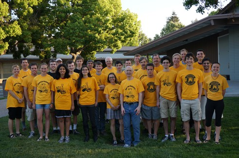

      
  
  

    

Our team is powered by our team members and mentors. A current list of team leadership is below; you can see a list of our mentors by using the link at the right.
<h2>2023 Team Leaders - TBA</h2><h3>Captain - Mechanical:  </h3>
The mechanical captain is in charge of leading the design and construction of the robot.
<h3>Captain - Software:  </h3>
The software captain is in charge of leading the design and implementation of the software for the robot.
<h3>President - Competition:  </h3>
The competition president is responsible for leading the team in preparing for and executing during competitions. This includes drive practise, scouting, pit crew and drive team coordination.
<h3>President - Entrepreneurship:  </h3>
The entrepreneurship president is responsible for leading all outreach and entrepreneurship activities. This includes sponsors, awards and the interface with the school and the ASB Council of Presidents.
<h3>Secretary: </h3>

The Secretary takes notes at every meeting and is responsible for managing publicity and team communication. 

<h3>Treasurer:  </h3>

The Treasurer is in charge of team funds and is responsible for keeping track of the balance and running spending and reimbursements.

<h2>2022 Team Leaders</h2><h3>Captain - Mechanical:  Kenneth Nishiyama</h3>
The mechanical captain is in charge of leading the design and construction of the robot.
<h3>Captain - Software:  Milind Upadhyay</h3>
The software captain is in charge of leading the design and implementation of the software for the robot.
<h3>President - Competition:  Marissa Tsoi</h3>
The competition president is responsible for leading the team in preparing for and executing during competitions. This includes drive practise, scouting, pit crew and drive team coordination.
<h3>President - Entrepreneurship:  Amanda Backholm</h3>
The entrepreneurship president is responsible for leading all outreach and entrepreneurship activities. This includes sponsors, awards and the interface with the school and the ASB Council of Presidents.
<h3>Secretary: Lara Fernando</h3>

The Secretary takes notes at every meeting and is responsible for managing publicity and team communication. 

<h3>Treasurer:  Pranav Siva</h3>

The Treasurer is in charge of team funds and is responsible for keeping track of the balance and running spending and reimbursements.

<h2>2021 Team Leaders</h2><h3>Captain - Mechanical:  Ethan Stone</h3>
The mechanical captain is in charge of leading the design and construction of the robot and fielding the robot and drive team at competitions.  The captain acts as the project manager for the build season.
<h3>Captain - Software:  NA - this position is currently unfilled</h3>
The software captain is in charge of leading the design and implementation of the software for the robot.
<h3>President - Competition:  Alex Wieland</h3>
The team President is the interface with the school and the ASB Council of Presidents.  The president also manages the non-technical leaders and tasks on the team.  
<h3>President - Entrepreneurship:  Mira Shah</h3>
The team President is the interface with the school and the ASB Council of Presidents.  The president also manages the non-technical leaders and tasks on the team.  
<h3>Secretary: Kate Stone</h3>

The Secretary takes notes at every meeting and is responsible for managing publicity and team communication. 

<h3>Treasurer: Christopher </h3>

The Treasurer is in charge of team funds and is responsible for keeping track of the balance and running spending and reimbursements.

<h2>2020 Team Leaders</h2><h3>Captain:  Sabina Davis</h3>
The team captain is in charge of leading the design and construction of the robot and fielding the robot and drive team at competitions.  The captain acts as the project manager for the build season.
<h3>Presidents:  Alex Wieland and Mira Shah</h3>
The team President is the interface with the school and the ASB Council of Presidents.  The president also manages the non-technical leaders and tasks on the team.  
<h3>Secretary: NA - this position is currently being managed by the presidents</h3>

The Secretary takes notes at every meeting and is responsible for managing publicity and team communication. 

<h3>Treasurer: Archer Parry</h3>

The Treasurer is in charge of team funds and is responsible for keeping track of the balance and running spending and reimbursements.

<h3>Other Officers</h3>

CAD Lead: Rishon Shah

Assembly Lead: Kayla Blalack

Manufacturing Lead: Kai Wessel

CAMMing coordination: Krishna Koganti

Drawings Lead: Bailey Lunn

Electrical Lead: Ethan Stone

Graphic Design lead: NA

Lab Management Lead: NA

Lab organization - travel set and parts bins: 

3D Printing Lead: Kseniia Stiagun

Prototyping Lead: Olivia Byun

New Member Coordination Lead: NA

Outreach and Demos Lead: Alana Segar

Technical Purchasing Lead: Olivia Byun

Receiving Lead: Lance Mathias

Inspection Lead: Lance Mathias

Mill and Lathe Scheduling Lead: Christopher Harjadi

Router Scheduling Lead: Krishna Koganti

Scouting Lead: Anirudh Kumar

Tool Training Lead: Lance Mathias

Awards Lead: Alana Segar

Media Lead: NA

Bumpers Lead: Eveline Tholen

<h2>2019 Team Leaders</h2><h3>Captain:  William Stanley</h3>
The team captain is in charge of leading the design and construction of the robot and fielding the robot and drive team at competitions.  The captain acts as the project manager for the build season.
<h3>President:  Suneel Freimuth</h3>
The team President is the interface with the school and the ASB Council of Presidents.
<h3>Secretary: Ashley Fong</h3>

The Secretary takes notes at every meeting and is responsible for managing publicity and team communication. 

<h3>Treasurer: John Parks</h3>

The Treasurer is in charge of team funds and is responsible for keeping track of the balance and running spending and reimbursements.

<h3>Other Officers</h3>

Design Architect/Education Lead: Bahar Maghbouleh

CAD Lead: Annie Wang

Assembly Lead: Kseniia Stiagun

Manufacturing Lead: Olivia Byun

CAMMing coordination: Kai Wessel

Drawings Lead: Benjamin Tice

Electrical Lead: Ethan Stone

Graphic Design lead: Emma Crowley

Lab Management Lead: Lyndsey Dworkin

Lab organization - travel set and parts bins: 

3D Printing Lead: Emerson Domke

New Member Coordination Lead: Mira Shah

Outreach and Demos Lead: Alana Segar

Technical Purchasing Lead: Marc (Jochem) Massalt

Receiving Lead: Cruz D'Antonio

Inspection Lead: Bailey Lunn

Mill and Lathe Scheduling Lead: Rishon Shah

Router Scheduling Lead: Christopher Harjadi

Scouting Lead Emma Crowley and Alex Wieland

Tool Training Lead: Archer Parry

Awards Lead: Maria Haggart

Media Lead: Ashley Fong

Bumpers Lead: Kayla Blalack

<h2>2018 Team Leaders</h2><h3>Captain:  Bahar Maghbouleh</h3>
The team captain is in charge of leading the design and construction of the robot and fielding the robot and drive team at competitions.  The captain acts as the project manager for the build season.
<h3>President:  Prayag Das</h3>
The team President is the interface with the school and the ASB Council of Presidents.
<h3>Secretary: Ashley Fong</h3>

The Secretary takes notes at every meeting and is responsible for managing publicity and team communication. 

<h3>Treasurer: John Parks</h3>

The Treasurer is in charge of team funds and is responsible for keeping track of the balance and running spending and reimbursements.

<h3>Other Officers</h3>

CAD Lead: Annie Wang

CAMMing coordination: Emerson Domke

Drawings Lead: Emre Ustuner

Electrical Lead: Rishon Shah

Graphic Design lead: Emma Crowley

Lab Management Lead: Lyndsey Dworkin

Lab organization - travel set and parts bins: Marc Massalt

Manufacturing Lead: William Thomas James Stanley

New Member Coordination Lead: Anya Singhal

Outreach and Demos Lead: Anya Shivastava

Purchasing Lead: Chris Mintz

Receiving Lead: Alex Kim

Router and Lathe Scheduling Lead: Kseniia Stiagun

Scouting Lead Emma Crowley

Tool Training Lead: Benjamin Tice

Awards Lead: Maria Haggart

Bumpers Lead: Anya Singhal 

<h2>2017 Team Leaders</h2><h3>Captains:  Ginger Schmidt, Campbell Crowley, Sabina Davis</h3>
The team captain is in charge of leading the design and construction of the robot and fielding the robot and drive team at competitions.  The captain acts as the project manager for the build season.
<h3>Presidents:  Bahar Maghbouleh, Nick Menand</h3>
The team President is the interface with the school and the ASB Council of Presidents.
<h3>Secretary: Annie Wang</h3>
The Secretary takes notes at every meeting and is responsible for managing publicity and team communication. 
<h3>Treasurer: Shaan Patel</h3>

The Treasurer is in charge of team funds and is responsible for keeping track of the balance and running spending and reimbursements.

<h3>Other Officers</h3>

Training Director: Elliot Hu

Purchasing Director: Sabina Davis

<h3> </h3><h2>2016 Team Leaders</h2><h3>Captains:
 Christina Segar, Mica Carroll-Muñoz, Liz Murray</h3>
The team captain is in charge of leading the design and construction of the robot and fielding the robot and drive team at competitions.  The captain acts as the project manager for the build season.
<h3>President: Comron Morshed</h3>
The team President is the interface with the school and the ASB Council of Presidents.
<h3>Secretary: Anya Singal</h3>
The Secretary takes notes at every meeting and is responsible for managing publicity and team communication. 
<h3>Treasurer: Adam Snaider</h3>

The Treasurer is in charge of team funds and is responsible for keeping track of the balance and running spending and reimbursements.
<h3>Other Officers</h3>

Training Director: Ryan Persons

Purchasing Director: Natalia Frumkin

<h3>   </h3>
<h2>2015 Team Leaders</h2><h3>Captains: Natalia Frumkin, Luke Knight, Spencer Witte</h3>
The team captain is in charge of leading the design and construction of the robot and fielding the robot and drive team at competitions.  The captain acts as the project manager for the build season.
<h3>Co-Presidents: Morgan McLain-Smith, Douglas Baney </h3>
The team President is the interface with the school and the ASB Council of Presidents.
<h3>Secretary: Elizabeth Murray</h3>
The Secretary takes notes at every meeting and is responsible for managing publicity and team communication. 
<h3>Treasurer: Trevor McGall</h3>

The Treasurer is in charge of team funds and is responsible for keeping track of the balance and running spending and reimbursements.
<h3>At Large Council Members: Erik Bahl, Comran Morshed</h3>
The At Large Council Members are responsible for attending leadership meetings and take a large part in making sure all aspects of the team are working. 

<h2>2014 Team Leaders</h2><h3>Captain: Brian Silverman</h3>
The team captain is in charge of leading the design and construction of the robot and fielding the robot and drive team at competitions.  The captain acts as the project manager for the build season.
<h3>Vice-Captain: Natalia Frumkin</h3>
Assists the captain and takes on major leadership roles.
<h3>President: Adrian Brandemuehl</h3>
The team President is the interface with the school and the ASB Council of Presidents.
<h3>Vice President: Jessica Fernandez</h3>
The Vice-President supports the Presidents in team organization and helping with the duties of President, like fundraising and recruitment.
<h3>Secretary: James Kuszmaul</h3>
The Secretary takes notes at every meeting and is responsible for managing publicity and team communication. 
<h3>Treasurer: Alex Perry</h3>

The Treasurer is in charge of team funds and is responsible for keeping track of the balance and running spending and reimbursements.
<h3>Other Positions</h3>
Programming: <strong>Brian Silverman</strong>

Scouting: <strong>Jocelyn Baird </strong>

Purchasing: <strong>Brian Silverman</strong>

Website Management: <strong>James Kuszmaul</strong>

Manufacturing Sponsor Lead: <strong>Adrian Brandemeuhl</strong>

<h2>2013 Team Leaders</h2>
<h3>Captain: Nick Crispie</h3>
The team captain is in charge of leading the design and construction of the robot and fielding the robot and drive team at competitions.  The captain acts as the project manager for the build season.
<h3>President: Maxwell Taylor</h3>
The team President is the interface with the school and the ASB Council of Presidents.
<h3>Treasurer: Alex Perry</h3>

The Treasurer is in charge of team funds and is responsible for keeping track of the balance and running spending and reimbursements.
<h3>Secretary: James Kuszmaul</h3>
The Secretary takes notes at every meeting and is responsible for managing publicity and team communication. 
<h3>Leadership Council:</h3>
The leadership council is a group of students and adults who meet on a regular basis to plan and organize team functions.  This structure is new this year and came from discussions with high performing teams at the championship event in St. Louis last year.  We took ideas that those teams were using to help structure team 971.  So far, this has been a successful addition to our team structure. (Spartan Robotics 2013 Team photo by Steve Silverman.  <a href="../images/FRC_971_TeamPhoto_2013_FullRes.jpg" target="_blank" rel="noopener">Full sized version</a>.)

<strong>Students:</strong>

Jocelyn Baird

Kevin Crispie
 James Kuszmaul

Alex Perry

 <strong>Adults: </strong>

Doug Baney

Finbarr Crispie

Mike Murray

Wyn Schuh
<h3><strong>Other Positions:</strong></h3>
Programming: <strong>Brian Silverman</strong>

Scouting: <strong>Jocelyn Baird </strong>

Purchasing: <strong>Brian Silverman</strong>

Awards: <strong>Kevin Crispie</strong>

Graphics: <strong>Morgan McLain-Smith</strong>

<h2>2012 Team Leaders</h2><h3>Presidents: Teresa Zarmer and Charlotte Swasey</h3>
The team Presidents work to keep the team running, which includes running fundraising, recruitment, and organizing team events.
<h3>Vice-President: Brandon Van Ryswyk</h3>
The Vice-President supports the Presidents in team organization while learning the duties of President, like fundraising and recruitment. He is also in charge of maintaining content on the website and writing award submissions such as Chairman's.
<h3>Captain: Nick Crispie</h3>
The team captain is in charge of leading the design and construction of the robot and fielding the robot and drive team at competitions.  The captain is also in charge of making sure that new members are brought up to speed and all other technical aspects of the team.
<h3>Treasurer: Kevin Crispie</h3>
The Treasurer is in charge of team funds and is responsible for keeping track of the balance and running spending and reimbursements.
<h3>Secretary: Melika Pambehchi</h3>
The Secretary takes notes at every meeting and is responsible for managing publicity and team communication.  The secratary also works with the captain and president on part documentation.
<h3>Cabinet:</h3>
Webmaster: <strong>James Kuszmaul</strong>

IT: <strong>Maxwell Taylor</strong>

PR: <strong>Travis Pinkner</strong>

Programming: <strong>Brian Silverman</strong>

Lab Organization: <strong>Hansmeet Singh</strong>

Ordering: <strong>Alex Perry</strong>

Awards: <strong>Kevin Crispie</strong>

Historian: <strong>Ariel Rao</strong>

<strong>    </strong>

<h2>2012 Season Guidelines and Expectations</h2><h3><em>Dec 11, 2012 Expectations Meeting summary by Nick</em></h3>
<em> </em>

People discussed goals for the season, many of which included improvements on things we have had trouble on in the past.  Many of the goals related to the desire to have 2 high quality robots done before ship day.   The main issues that we addressed were the questions over Who has ultimate authority, what is the role of mentors and what happens when deadlines get missed.   About who has authority, it was decided that the captain was the final say in all technical decisions during build season and the competition.  This does not mean the captain makes all the decisions, but has ultimate authority.  Safety decisions however, rest with the adult mentors.   As for mentors, we have talked about this before, and we always vaguely put ourselves somewhere in the middle.  We decided this time that instead of theoretical, in practice what it would look like.  We agreed that we wanted mentor involvement to continue to encourage students to learn at a high level, instead of students figuring things out with trial and error.   In the aspect of what to be done when deadlines get missed, we first decided that we plan on having a visible master schedule and have project leaders and the captain set clear deadlines of what needs to get done when.  After that, it is the responsibility of both the management and the person working on the project to communicate effectively so resources are allotted as necessary to finish the job. This allows management to be in a constant state of evaluating how things are going to better meet the overall build schedule and manage tasks that are both non reliant and reliant on other aspects of build.   One thing to make clear is that if a deadline has passed and someone else works on a project to make sure we meet a deadline or to finish something, it does not mean that the original person working on it failed.  The team understands that things happen, and something may not get done.  The best thing to do when you don't think you will be able to meet a deadline is the notify someone before the deadline so something can be done about it.  Regardless, just as a recommendation, do not get too attached to a project, since even if it is completed on time, it will most likely go through several iterations before going on the robot, or may not go on the robot at all depending on how the design evolves.   As an end note, we discussed meeting times, and we decided that it would be advantageous to have one evening meeting in the middle of the week so mentors can help.  We tentatively decided on Tuesday evenings for these meetings, so Tuesdays we would meet after dinner instead of after school.

<strong> </strong>

<h2>2011 Team Leaders</h2><h3>Team Captain: Scott</h3>
The team captain is in charge of making sure that there is a robot built and that new members 
are brought up to speed. Scott joined the team in 2009 and leads the designing, fabrication, and assembly of the robots.  The captain also keeps contanct with materials sponsors for building the robot.

 
<h3>Co-Team Presidents: Izzie and Jai</h3>
The team Presidents work to keep the team running, which includes running fundraising, recruitment, and organizing team events. Jai and Izzie joined the team in 2008. They manages the team’s finances, work with sponsors, register for competitions, organize community outreach, and work with Jonathan to maintain the website.

           
<h3>Co-Vice Presidents: Charlotte and Teresa</h3>
The Vice-Presidents support the Presidents in team organization while learning the duties of President, like fundraising and recruitment. They are also in charge of maintaining content on the website and writing award submissions such as Chairman's. Charlotte and Teresa joined the team in 2009.

 
<h3>Secretary: Nick</h3>
The Secretary takes notes at every meeting and is responsible for managing publicity and team communication.  The secratary also works with the captain and president on part documentation.  Nick has been a part of Spartan Robotics since the summer of 2009.

 
<h3>Treasurer: Kevin</h3>
The Treasurer is in charge of team funds and is responsible for keeping track of the balance and running spending and reimbursements.  Kevin has been a team member since summer 2009.

 
<h3>Web Programs Manager: Jonathan</h3>
Jonathan installed Drupal, developed a Drupal module for viewing Google Picasa Web albums in PHP, created an extremely high-performance photo viewer with jQuery, and wrote automated quizzing software (used to administer the safety test).

 
<h2>Team Members</h2>
In addition to the above:  Alex, Alice, Audrey, Benjamin, Brandon, Brian, Charlie, Chaz, Dishaan, Fernando, Jack, James, Jonathan, Maxwell, Melika, Michael, Nick, Parker, Ryan, Steven, Teresa

 

Tags:&nbsp;

<a href="../tags/about.html">About</a>

<a href="../tags/members.html">Members</a>

  

  